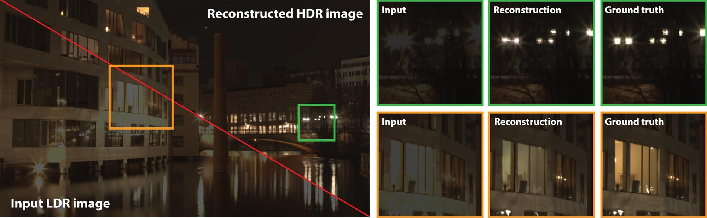

# HDR

## HDRCNN (Siggraph Asia 2017)
[HDR image reconstruction from a single exposure using deep CNNs (Siggraph Asia 2017)](https://arxiv.org/abs/1710.07480)  
A hybrid dynamic range autoencoder that is tailored to operate on LDR input data and output HDR images. It utilizes HDR specific transfer-learning, skip-connections, color space and loss function

## Deep Reverse Tone Mapping (2017)
[Deep Reverse Tone Mapping](http://www.npal.cs.tsukuba.ac.jp/~endo/projects/DrTMO/)
input: 
1. LDR image
2. Fully CNNs: up-exposure model & down-exposure model → infer bracketed image
merge up-exposed and down-exposed image  
  
HDR image database is for creating bracketed LDR image by simulating cameras

## DeepHDR (ECCV 2018)
[https://arxiv.org/abs/1711.08937](https://arxiv.org/abs/1711.08937)
[Project](https://elliottwu.com/projects/hdr/) | 
[Tensorflow](https://github.com/elliottwu/DeepHDR)
> This paper proposes the first **non-flow-based** deep framework for high dynamic range (HDR) imaging of dynamic scenes with large-scale foreground motions. (without optical flows)

## hdrnet (Siggraph 2017)
* [hdrnet](/CNN/img2img/hdrnet.md)

## Deep Photo Enhancer (CVPR 2018)
[Deep Photo Enhancer: Unpaired Learning for Image Enhancement from Photographs with GANs](https://www.cmlab.csie.ntu.edu.tw/project/Deep-Photo-Enhancer/CVPR-2018-DPE.pdf)  
[Tensorflow implementation](https://github.com/nothinglo/Deep-Photo-Enhancer)  
trackle the problem with two-ways GAN whose structure similar to [CycleGAN](/GAN/cycleGAN.md)  
individual batch normalization layers in generators with raw/ generated source  
**iBN**: without iBN, color will be broken  
**Global features**: extract iin layer 5, FC until 1x1x128, duplicated to 32x32x128  
**adaptive WGAN (A-WGAN)**  
__**Limitations**__
amplify noise if the input is very dark and contains a significant amount of noise. 
In addition, since some HDR images for training are products of tone mapping, our model could suffer from *halo artifacts* inherited from tone mapping for some images

## ExpandNet (Eurographics 2018)
[ExpandNet: A Deep Convolutional Neural Network for High Dynamic Range Expansion from Low Dynamic Range Content](https://arxiv.org/abs/1803.02266)
**test on video HDR**: Black might blended to some color, probably because of the loss. If setting lambda to zero, black become pure black without details. Is it really a good choise to use linear RGB? It seems that dark color is difficult to train because it is too small on linear domain.

## Bit-Net (ACCV 2018)
[BitNet: Learning-Based Bit-Depth Expansion](https://arxiv.org/abs/1910.04397)