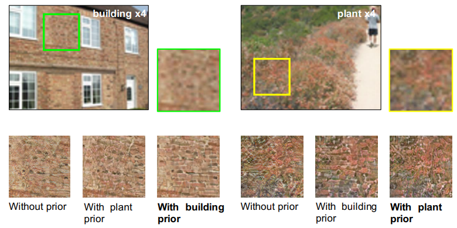

# Super-resolution

some cross-project repo:
[Martin Krasser/Keras-super-resolution](https://github.com/krasserm/super-resolution): SRGAN, EDSR, WDSR  
[open-mmlab/MMSR](https://github.com/open-mmlab/mmsr): SRResNet, SRGAN, ESRGAN, EDVR, etc.
## SRCNN (TPAMI 2014)
[Image Super-Resolution Using Deep Convolutional Networks](https://arxiv.org/abs/1501.00092) by CUHK  
[Project](http://mmlab.ie.cuhk.edu.hk/projects/SRCNN.html) - include Matlab and Caffe code  
first upscale it to the desired size using bicubic interpolation
### FSRCNN (ECCV 2016)
[Accelerating the Super-Resolution Convolutional Neural Network](https://arxiv.org/abs/1608.00367) by CUHK  
use deconvolution to upscale instead of pre-processing  
## VDSR (CVPR 2016)
[Accurate Image Super-Resolution Using Very Deep Convolutional Networks](https://arxiv.org/abs/1511.04587)  
start to use residual, one long skip-connection  
  
Same as SRCNN, it take upscaled LR image as imput  

## SRGAN (CVPR 2017)
[Photo-Realistic Single Image Super-Resolution Using a Generative Adversarial Network](https://arxiv.org/abs/1609.04802) by Twitter  
[Tensorflow 2.0](https://github.com/tensorlayer/srgan)  
SRResNet + long skip-connection, diverge from MSE
**novel** perceptual loss using high-level feature maps of VGG network  

## EDSR (CVPR 2017)
[Enhanced Deep Residual Networks for Single Image Super-Resolution](https://arxiv.org/abs/1707.02921)
remove batch normalization of [SRResNet](#srgan-cvpr-2017)→ save resource 
spend resource on convolution instead

## WDSR (CVPR 2018) 
[Wide Activation for Efficient and Accurate Image Super-Resolution](https://arxiv.org/abs/1808.08718)  
[pyTorch based on EDSR](https://github.com/JiahuiYu/wdsr_ntire2018) | [tensorflow](https://github.com/ychfan/tf_estimator_barebone/blob/master/docs/super_resolution.md) 
  
increase channel before ReLU 
linear low-rank convolution stack and large channel
Official implemenetation (PyTorch based on EDSR)
TensorFlow-WDSR (official)
Keras-super-resolution (Single Image Super-Resolution with WDSR, EDSR and SRGAN) By Martin Krasser

## SFTGAN (CVPR 2018)
[Recovering Realistic Texture in Image Super-resolution by Deep Spatial Feature Transform](https://arxiv.org/abs/1804.02815) by senseTime  
**Spatial Feature Transform**: learns a mapping function ``$`M`$`` that outputs a modulation parameter pair (``$` `$``
generate affine transformation parameters for spatial-wise feature modulation  

## ESRGAN (ECCV 2018)
[ESRGAN: Enhanced Super-Resolution Generative Adversarial Networks](https://arxiv.org/abs/1809.00219) from CUHK  
RRDB (Residual in Residual Dense Blcok)

## ===Video super-resolution===

## EDVR (CVPR 2019)
[EDVR: Video Restoration with Enhanced Deformable Convolutional Networks](https://arxiv.org/abs/1905.02716) from SenseTime, CUHK  
[Project](https://xinntao.github.io/projects/EDVR) | [pyTorch (deperciated)](https://github.com/xinntao/EDVR) | [MMSR](https://github.com/open-mmlab/mmsr)

##### PCD and TSA Modules
**Left**: PCD alignment module with Pyramid, Cascading and Deformable convolution; **Right**: TSA fusion module with Temporal and Spatial

## Zooming Slow-Mo (CVPR 2020)
[Video Frame Interpolation/Zooming Slow-Mo](video_frame_interpolation.html#zooming-slow-mo-cvpr-2020)