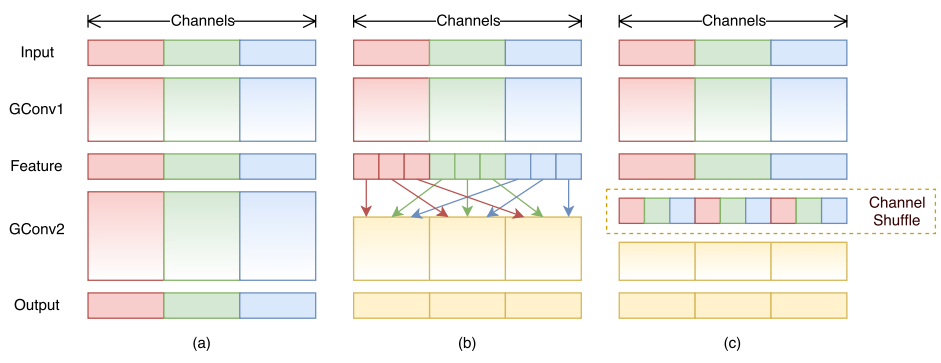
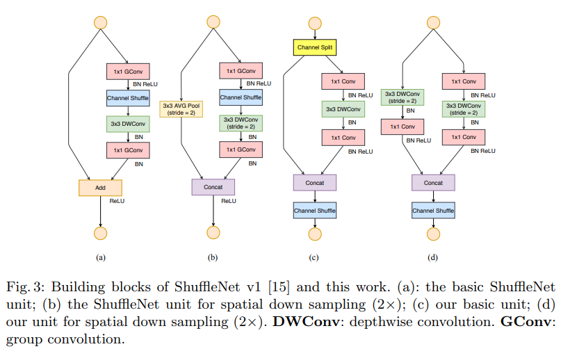

# Light-Weight Models
Addition: The computation of below model reduced, but the number of layers might be increased. It is faster on CPU, but might not faster on GPU because of bandwidth limitation. See discussion: [为什么 MobileNet、ShuffleNet 在理论上速度很快，工程上并没有特别大的提升？](https://www.zhihu.com/question/343343895)
## MobileNet v1
[MobileNets: Efficient Convolutional Neural Networks for Mobile Vision Applications](https://arxiv.org/pdf/1704.04861.pdf) by Google  
### Depthwise Separable Convolution
seperate general convolution into 2 part: depthwise + pointwise
* depthwise: compute within each channel 
* pointwise: 1x1 convolution on depthwise result
i.e. drop cross-channel and cross-point connections
Compression of Depthwise Separable Convolution
```math
\frac{depthwise+pointwise}{conv}=\frac{h\times w \times c_1 \times 3 \times 3 + h \times w \times c_2 \times k}{h \times w \times c_1 \times c_2 \times 3 \times 3} = \frac 1{c_2} + \frac 1{3 \times 3}
```
## ShuffleNet v1 (CVPR 2018)
[ShuffleNet: An Extremely Efficient Convolutional Neural Network for Mobile Devices](https://arxiv.org/abs/1707.01083) by face++  
concurrent work of [Interleaved Group Convolutions for Deep Neural Networks]
### Group Convolution and Channel Shuffle
Seperate channels into different groups, convolution run within groups. Then channel shuffle the output of groups output.

```math
3 \times 3 \times h \times w + \frac{h \times w \times c_1 \times c_2}{g} + \text{shuffle cost}
```
## MobileNet v2 (CVPR 2018)
[MobileNetV2: Inverted Residuals and Linear Bottlenecks](https://arxiv.org/abs/1801.04381) by Google  
[tensorflow code](https://github.com/tensorflow/models/tree/master/research/slim/nets/mobilenet) | [blog](https://ai.googleblog.com/2018/04/mobilenetv2-next-generation-of-on.html)
### Inverted residual with linear bottleneck
shortcut connections between the bottlenecks


## ShuffleNet v2 (ECCV 2018)
[ShuffleNet V2: Practical Guidelines for Efficient CNN Architecture Design](https://arxiv.org/abs/1807.11164) by face++  
[papers with code](https://paperswithcode.com/paper/shufflenet-v2-practical-guidelines-for)
### Channel split
Excessive group convolution increases memmory access cost (MAC). Hence, use simple channel split instead of group convolution  
