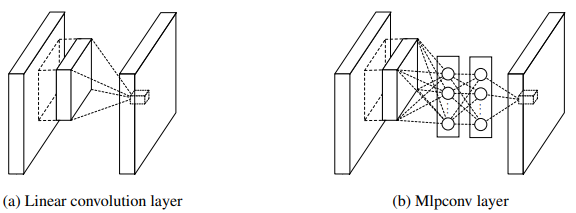
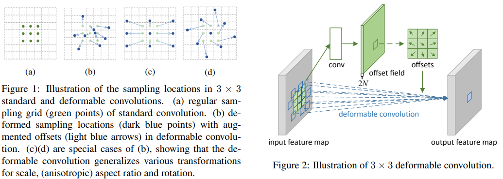

# CNN Models

## LeNet-5 (1998)
[Gradient-Based Learning Applied to Document Recognition](http://www.dengfanxin.cn/wp-content/uploads/2016/03/1998Lecun.pdf)

## AlexNet (NIPS 2012)
ReLu: solve vanishing gradient, training process faster  
dropout: solve overfitting  
LRN: normalization
[ImageNet Classification with Deep Convolutional Neural Networks](https://papers.nips.cc/paper/4824-imagenet-classification-with-deep-convolutional-neural-networks.pdf)
### Local Response Normalization
[Normalization/LRN](/basic/normalization.html#local-response-normalization-nips-2012)

## VGG (ICLR 2014)
[Very Deep Convolutional Networks for Large-Scale Image Recognition](https://arxiv.org/abs/1409.1556)  
replace large kernel by mult. small kernels  
receptive field of 3x3+3x3 = 5x5  
parameters 18 < 25  
the network loss to inception, but the pretrained network is useful for image feature embedding  

## NIN (ICLR 2014)
[Network In Network(ICLR 2014)](https://arxiv.org/abs/1312.4400)
### MLPconv (ICLR 2014)

### GAP
[visualization/GAP](visualization.html/#gap-iclr-2014)


## Inception
* [Inception](inception.md)

1. auxiliary classifiers
1. batch normalization
1. factorizing convolutions
1. residual scaling

## STN (CVPR 2015)
[Spatial Transformer Networks](https://arxiv.org/abs/1506.02025) from DeepMind  
learn spatial transformation from data in a deep learning framework. It warps the feature map via a global parametric transformation such as affine transformation
1. **Localisation net**: predict transform parameters ``$` \theta `$``
1. **Parameterised Sampling Grid**: apply ``$` \theta `$``
1. **Differentiable Image Sampling**: apply sampling kernel which defines the image interpolation (e.g. bilinear)

Backpropagation: differentiate through the sampling mechanism.
[r/what_happened_to_spatial_transformers](https://www.reddit.com/r/MachineLearning/comments/9moyzk/d_what_happened_to_spatial_transformers/) seems easily collapsed  
alternative: [Deformable Convolution](#deformable-convolution)

## U-Net (MICCAI 2015)
[U-Net: Convolutional Networks for Biomedical Image Segmentation](https://arxiv.org/abs/1505.04597)
An encoder-decoder architecture with skip-connections that forward the output of encoder layer directly to the input of the corresponding decoder layer through channel-wise concatenation.


## ResNet (CVPR 2016)
Residual Network  
[Deep Residual Learning for Image Recognition](https://arxiv.org/abs/1512.03385)

preserve information, learning details
also solve 	1. vanishing gradient
            2. Degradation problem
### Degradation problem
deeper network give higher train & test error than shallover network


### ResNet vs U-Net
Both are method to skip connection

ResNet / residual block|U-Net
---|---
short connection usually, very general|long connection
element-wise sum|concatenation
channel remain the same|channel increase when concatentation (feature duplicated)
keep w,h/ resolution|down-scaling in-between, upscale before concatentation

## Deconvolution
The naming of “deconvolution”/ “transposed convolution” is quite unclear, so I put it together for direct comparison.
1. Upsampling, image generation
1. Covolutional sparse coding, unspervised learning
1. Visualization


ref: [谭旭: 如何理解深度学习中的deconvolution networks？ - 知乎](https://www.zhihu.com/question/43609045/answer/132235276)
### Upsampling, image generation
Also called **Fractionally strided convolutions**  
inidivual, not related to previous convolution  

[more animations](https://github.com/vdumoulin/conv_arithmetic)  
Upsampling with deconvolution might lead to checkerboard artifact because of strides, [pixelShuffle](#pixelshuffle-cvpr-2016) could fully utils all weights hence and solve this issue    
Paper using deconvolution for upsampling:
1. [autoencoder](/generative_models/autoencoder.md)
1. “deconvolutional” generator from [GAN (NIPS 2014)](/GAN/index.md)
1. [segmentation/FCN](object_detection/segmentation.html#fcn-cvpr-2015): [Fully convolutional networks for semantic segmentation (CVPR 2015)](https://arxiv.org/abs/1605.06211) 
1. [DeconvNet: Learning deconvolution network for semantic segmentation (ICCV 2015)](https://arxiv.org/abs/1505.04366)
**unpooling**: use the max locations of the encoder feature maps (pooling indices) to perform non-linear upsampling in the decoder network  
**deconvolution**: convolution transpose  
### Covolutional sparse coding, unspervised learning
Train an autoencoder first, then use deconvolution to extract features from trained weights.
1. [Deconvolutional networks (CVPR 2010)](https://www.matthewzeiler.com/mattzeiler/deconvolutionalnetworks.pdf) - Matthew D. Zeiler
1. [Adaptive deconvolutional networks for mid and high level feature learning (ICCV 2011)] - Matthew D. Zeiler  
### Visualization
Compute transpose of trained convolutional layer, to visualize the pixels that activate specified feature (channel in high-level layer), understand the approximate purpose of each convolution filter  
1. [FZNet: Visualizing and Understanding Convolutional Networks (ECCV 2013)](https://cs.nyu.edu/~fergus/papers/zeilerECCV2014.pdf) - Matthew D. Zeiler  

## PixelShuffle (CVPR 2016)
[Real-Time Single Image and Video Super-Resolution Using an Efficient Sub-Pixel Convolutional Neural Network](https://arxiv.org/abs/1609.05158)


## Fusing global feature
[Let there be Color! (2016)](/CNN/img2img/colorization#let-there-be-color-siggraph-2016)
fusion layer  
usually used for global feature

## CAM (CVPR 2016)
[CNN/visualization/CAM](visualization.html#cam-cvpr-2016)


## DenseNet (CVPR 2017)
[Densely Connected Convolutional Networks](https://arxiv.org/abs/1608.06993)
Connect to previous layer with concatenation (rather than sum)  
Many said it is not quite useful and using residual instead. 
From visualization result, seems low-layer feature really useful for high layer. (Maybe the middle level layer will learn middle level information without storing low level info with DenseNet architecture.)  
### [Memory-Efficient Implementation of DenseNets](https://arxiv.org/pdf/1707.06990.pdf)
DenseNet less parameters but require more memory because of implementation of concatenation. Could be optimizated via shared memory.
### Ablation Experiments of other paper:
[PWC-Net](img2img/optical_flow.html#pwc-net-cvpr-2018)
> Removing the DenseNet connections results in higher training error but lower validation errors when the model is trained on FlyingChairs. However, after the model is fine-tuned on FlyingThings3D, DenseNet leads to lower errors.
PWC-Net-small further reduces this by an additional 2 times via dropping DenseNet connections and is more suitable for memorylimited applications

## CapsuleNet (2017)
[Dynamic Routing Between Capsules](https://arxiv.org/abs/1710.09829)
For dynamic routing
vector to vector instead of scalar to scalar

## Deformable Convolution
### DCNv1 (ICCV 2017)
[Deformable Convolutional Networks](http://openaccess.thecvf.com/content_ICCV_2017/papers/Dai_Deformable_Convolutional_Networks_ICCV_2017_paper.pdf) from MSRA  
[MXNet](https://github.com/msracver/Deformable-ConvNets)  
  

```math
y(p)=\sum^K_{k=1}w_k \dot x(p+p_k+\delta p_k)
```
The backpropagation of ``$`\delta p_k`$`` is similar to [STN](#stn).
comparing to STN, Deformable ConvNet samples the feature map in a local and dense manner  

### DCNv2 (CVPR 2019)
[Deformable ConvNets v2: More Deformable, Better Results](https://arxiv.org/abs/1811.11168) from MSRA  
1. Stacking More Deformable Conv Layers
1. modulated deformable convolution
    ```math
    y(p)=\sum^K_{k=1}w_k \dot x(p+p_k+\delta p_k) \dot \delta m_k
    ```
    output 3K channels, where first 2K correspond to ``$` {\delta p_k}^K_{k=1} `$``, remaining K channels further fed to sigmoid to obtain ``$` \{\delta m_k\}^K_{k=1} `$``
1. R-CNN Feature Mimicking (knowledge distillation) to Faster R-CNN

Some said the detection result of DCNv1, v2 is not SOTA. However, the novelty is very high and it could be applied to many other img2img tasks with good result, such as [EDVR]. From the experience of training EDVR, training with DCN is unstable.  
## Deep Layer Aggregation, DLA (CVPR 2018)
[Deep Layer Aggregation](https://arxiv.org/abs/1707.06484)  
image classification network with hierarchical skip connections

## CSPNet (2019)
[CSPNet: A New Backbone that can Enhance Learning Capability of CNN](https://arxiv.org/abs/1911.11929v1)  
[Darknet code](https://github.com/WongKinYiu/CrossStagePartialNetworks) | 
[AlexeyAB darknet](https://github.com/AlexeyAB/darknet/issues/4406)  

## Light-weights models
* [Light-weights model](/CNN/light-weight_models.md)