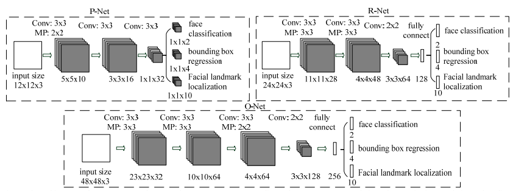
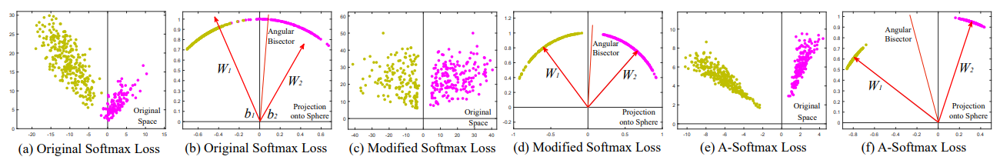
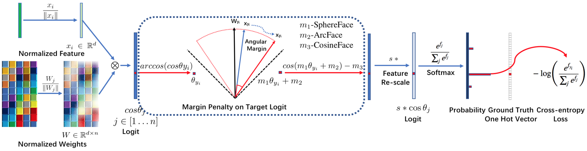

# Face
## Face Detection

### DenseBox (2015)
[Object detection/DenseBox](/CNN/object_detection/object_detection.md#densebox-2015)

### MTCNN (SPL 2016)
[Joint Face Detection and Alignment using Multi-task Cascaded Convolutional Networks](https://arxiv.org/abs/1604.02878)  
code: [https://kpzhang93.github.io/MTCNN_face_detection_alignment/](https://kpzhang93.github.io/MTCNN_face_detection_alignment/)
Detection & landmark
Pyramid
PNet, RNet ONet


### SSH (ICCV 2017)
[SSH: Single Stage Headless Face Detector](https://arxiv.org/abs/1708.03979)
decrease inference time  
scale-invariant  
fixed size arcter to replace proposal  


### DSFD (CVPR 2019)
[DSFD: Dual Shot Face Detector](https://arxiv.org/abs/1810.10220)  
Feature Enhance Module (FEM) 

## Face Feature Embedding
Could used for recognition with simple classifier

### DDML (CVPR 2014)
[Discriminative Deep Metric Learning for Face Verification in the Wild](https://www.cv-foundation.org/openaccess/content_cvpr_2014/papers/Hu_Discriminative_Deep_Metric_2014_CVPR_paper.pdf)
learn a nonlinear transformations and yield discriminative deep metric with a margin between positive and negative image pairs
#### Contrastive Loss
Same class => close  
Different class => distance > margin m

### FaceNet (CVPR 2015) 
[FaceNet: A Unified Embedding for Face Recognition and Clustering](https://arxiv.org/abs/1503.03832)
#### Triplet Loss
inspirated by LMNN (large margin nearest neighbor)  
Triplet Loss with VAE  
Triplet selection/ present a novel online negative exemplar mining strategy which ensures consistently increasing difficulty of triplets as the network trains  
disadv: data expansion when constituting the sample pairs  

### Centre Loss (ECCV 2016)
[A Discriminative Feature Learning Approach for Deep Face Recognition](https://kpzhang93.github.io/papers/eccv2016.pdf)
add center Loss to softmax, hence the model discriminative power enhanced  
```math
L_c = \frac{1}{2} \sum^m_{i=1} {||{x_i - c_{y_i}}||}^2_2
```


### SphereFace (CVPR 2017)
[SphereFace: Deep Hypersphere Embedding for Face Recognition](https://arxiv.org/abs/1704.08063)
in an angular space and penalises the angles between deep features  
normalize W, optimize feature embedding and angle  
disadv: requires a series of approximation in order to be computed,, resulted in unstable training. softmax loss used to stabilise training dominate the training process.  


### CosFace (CVPR 2018)
add cosine margin penalty to the target logit
admits easier implementation and relieves the need for joint supervision from the softmax loss

### ArcFace
[ArcFace: Additive Angular Margin Loss for Deep Face Recognition](https://arxiv.org/abs/1801.07698)
Implementation: [https://github.com/deepinsight/insightface]  
RetinaNet: detection  
InsightNet: embedding  
  

