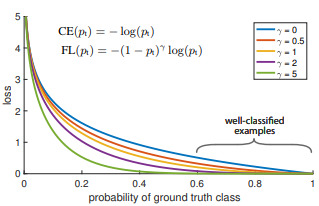

# Focal Loss
[Focal Loss for Dense Object Detection](https://arxiv.org/abs/1708.02002)  
address this class imbalance by reshaping the standard cross entropy loss such that it down-weights the loss assigned to well-classified examples


For notational convenience: 
```math
p_t=
\begin{cases}
    \hat{y}             , & \text{if } y=1\\
    1-\hat{y}           , & \text{otherwise}
\end{cases}
```
focal loss
```math
FL(y) = -(1-p_t)^\gamma log(p_t)
```
``$`\alpha`$``-balanced variant
```math
FL(y) &= -\alpha_t(1-p_t)^\gamma log(p_t)\\
&=-\alpha_t
\begin{cases}
(1-\hat{y})^\gamma log(\hat{y}) , & \text{if } y=1 \\
\hat{y}^\gamma log(1-\hat{y})   , & \text{otherwise}
\end{cases}
\\
&= -\alpha_t(y(1-\hat{y})^\gamma log(\hat{y})
+(1-y)\hat{y}^\gamma log(1-\hat{y}))
```