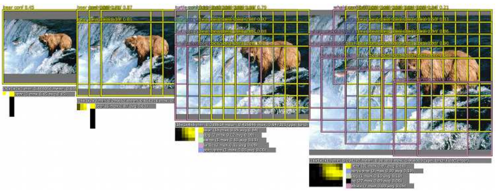
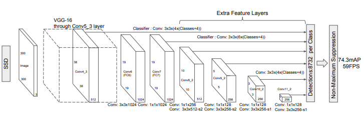
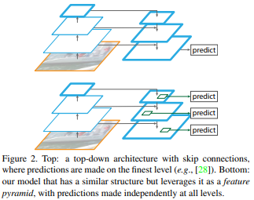
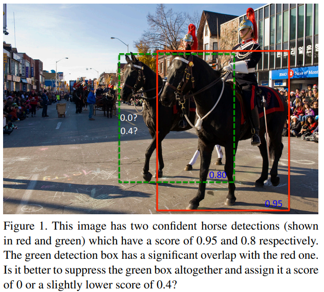
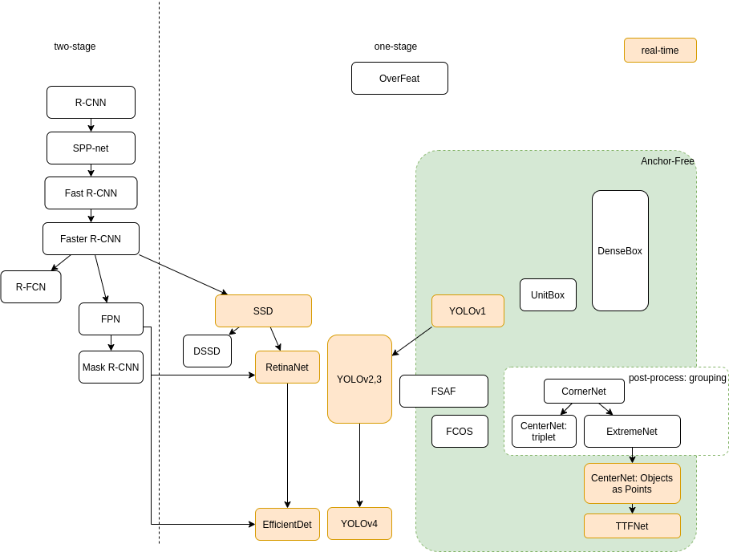

# Object Detection
## OverFeat (ILSVRC 2013)
[OverFeat: Integrated Recognition, Localization and Detection using Convolutional Networks](https://arxiv.org/abs/1312.6229)  
sliding windows + feature Extractor + multi-scale Classification

## R-CNN (CVPR 2014)
[Rich feature hierarchies for accurate object detection and semantic segmentation](https://arxiv.org/abs/1311.2524)  
Regions with CNN features  
1. generate region proposals by _Selective Search_, warpped to fixed size
2. embedding (one shot) features with CNN
3. detect & classify object by SVM
4. *adjust boundary box* by linear regression
### Bounding-Box Regression
``$`P=(P_x, P_y, P_w, P_h)`$``: the pixel corrdinates of the center of proposal together with width and height  
``$`G=(G_x, G_y, G_w, G_h)`$``: the ground-truth  
``$`\hat{G}`$``: predicted ground-truth  
``$`d_x(P), d_y(P)`$``: scale-invariant translation of P_x, P_y  
``$`d_w(P), d_h(P)`$``: log-space translation of P_w, P_h  
```math
\begin{split}
&\hat{G}_x=P_wd_x(P)+P_x\\
&\hat{G}_y=P_hd_y(P)+P_y\\
&\hat{G}_w=P_we^{d_w(P)}\\
&\hat{G}_h=P_he^{d_h(P)}
\end{split}
```
### Selective Search
[Selective Search for Object Recognition](http://www.huppelen.nl/publications/selectiveSearchDraft.pdf)  
Hierarchical Grouping Algorithm, merge from small segment to large proposal
### Non-Maximum Suppression, NMS
Post-processing to removes dupliicated detection for the same instance by [IoU](/CNN/object_detection/measurement#intersection-over-union-iou)

## Spatial Pyramid Pooling, SPP-net / SPPNet (TPAMI 2015)
[Spatial Pyramid Pooling in Deep Convolutional Networks for Visual Recognition](https://arxiv.org/abs/1406.4729)  
Previous model require a fixed-size input image.  
### SPP
*spatial pyramid pooling layer* get fixed size output from flexible size input via adapting the step size  
Improve _Bag-of-Words (BoW)_ to maintain *spatial infomation* by pooling in _local spatial bins_. These spatial bins have sizes proportional to the image size, so the number of bins is fixed regardless of the image size.

## Fast R-CNN (ICCV 2015)
[Fast R-CNN](https://arxiv.org/abs/1504.08083)  
R-CNN, SPP drawbacks:
> Training is a multi-stage pipeline that involves extracting features, fine-tuning a network with log loss, training SVMs. Fine-tuning algorithm cannot update the CNN that precede spatial pyramid pooling.  

Fast R-CNN: using fully connected classifer so it could also train the CNN features.  
Contributions:  
* Training is single-stage, using a multi-task loss
* Training can update all network layers

1. generate region proposals by _Selective Search_
2. embedding (one shot) features with CNN with flexible size input
3. bounding box regression
4. classification with fully connnected network
### RoI Pooling
> The RoI layer is simply the special-case of the spatial pyramid pooling layer used in SPPnets in which there is only one pyramid level.

## Faster R-CNN (NIPS 2015)
  
7fps
### Region Proposal Network (RPN)
An RPN is a fully convolutional network that simultaneously predicts object bounds and objectness scores at each position with *anchor*. (RPN replace selective search to produce region proposal.)  

>>To generate region proposals, we slide a small network over the convolutional feature map output by the last shared convolutional layer. This small network takes as input an n × n spatial window of the input convolutional feature map. Each sliding window is mapped to a lower-dimensional feature (256-d for ZF and 512-d for VGG, with ReLU following). This feature is fed into two sibling fully connected layers—a box-regression layer (reg) and a box-classification layer (cls).
It shares full-image convolutional features with the detection network, thus enabling nearly cost-free region proposals.  
#### Anchors
>>At each sliding-window location, we simultaneously
predict multiple region proposals, where the number
of maximum possible proposals for each location is
denoted as k. So the reg layer has 4k outputs encoding
the coordinates of k boxes, and the cls layer outputs
2k scores that estimate probability of object or not
object for each proposal

## DenseBox (2015)
[DenseBox: Unifying Landmark Localization with End to End Object Detection](https://arxiv.org/abs/1509.04874)  
one-stage fully convolutional neural network (FCN), single-scale  
1. FCN, if designed and optimized carefully, can detect multiple different objects extremely accurately and efficiently
2. incorporating with landmark localization during multi-task learning, DenseBox further improves object detection accuray  
*anchor free*, no proposal required  
### Detection
input: ``$`m\times n`$`` image  
the left top and right bottom points of the target bounding box: ``$`p_t=(x_t, y_t), p_b=(x_b, y_b)`$`` in output corrdinate space 
output: a ``$`\dfrac{m}{4}\times\dfrac{n}{4}`$`` feature map with 5 channels, ``$`\hat{t}_i=\{\hat{s}, \hat{dx^t} = x_i − x_t, \hat{dy^t} = y_i −y_t,\hat{dx^b} = x_i − x_b,\hat{dy^b} = y_i − y_b\}`$``  
``$`\hat{s}`$`` is confidence score  
``$`\hat{dx^t}, \hat{dy^t}, \hat{dx^b}, \hat{dy^b}`$`` is the distance between pixel i with boundary of target bounding box  
#### Multi-Level Feature Fusion
Upsampling so the feature map of high resolution also contains high level context information. (Similar to FPN)  
##### Receptive field (Object size)
DenseBox is designed for *small* scales and heavy occlusion.  
Receptive field is 48x48 (conv3_4) and 118x118 (conv4_4). 48x48 is said to be almost the same size of the face size, but it might be not large enough for other object detection.  
#### Multi-Task Training
landmark localization
##### Balance Sampling
###### Ignoring Gray Zone
###### Hard Negative Mining

## R-FCN (NIPS 2016)
[R-FCN: Object Detection via Region-based Fully Convolutional Networks](https://arxiv.org/abs/1605.06409)
based on RPN of Faster R-CNN, extract RoI from 9 corners heatmaps  

## MTCNN (2016)
[face_detection/MTCNN](face_detection.md#mtcnn-2016)

## UnitBox (ACM MM 2016)
[UnitBox: An Advanced Object Detection Network](https://arxiv.org/abs/1608.01471)  
* introduce a novel *Intersection over Union (IoU) loss function*
* adopts a fully convolutional network architecture, to predict the object bounds as well as the *pixel-wise classification scores* on the feature maps directly (~ DenseBox)

## SSD (ECCV 2016)
[SSD: Single Shot MultiBox Detector](https://arxiv.org/abs/1512.02325)  
*One-stage*: detecting objects in images using a single deep neural network
> The core of SSD is predicting category scores and box offsets for *a fixed set of default bounding boxes using small convolutional filters applied to feature maps*
Or a multi-scale version YOLOv1  

1. Apply *anchor* boxes on different layers directly to extract features. Replace region proposal to increase speed.
2. dilated convolution to increase receptive field
3. data augmentation

* *faster* (59fps) since it is single shot (no proposal)  
Drawback: Difficult to detect small object since low level layer do not have high level feature  

### DSSD (2017)
[SSD: Deconvolutional Single Shot Detector](https://arxiv.org/abs/1701.06659)

## YOLO (2015~)
* [YOLO](/CNN/object_detection/YOLO.md)  

## FPN (CVPR 2017)
[Feature Pyramid Networks for Object Detection](https://zpascal.net/cvpr2017/Lin_Feature_Pyramid_Networks_CVPR_2017_paper.pdf)
### Bottom-up pathway
ResNets  
### Top-down pathway and lateral connection
>The topdown pathway hallucinates higher resolution features by
upsampling spatially coarser, but semantically stronger, feature maps from higher pyramid levels. These features are
then enhanced with features from the bottom-up pathway
via lateral connections. Each lateral connection merges feature maps of the same spatial size from the bottom-up pathway and the top-down pathway. The bottom-up feature map
is of lower-level semantics, but its activations are more accurately localized as it was subsampled fewer times.


## Soft-NMS (ICCV 2017)
[Soft-NMS -- Improving Object Detection With One Line of Code](https://arxiv.org/abs/1704.04503)  
*Non-maximum suppression(NMS)*: 
>>The detection box M with the
maximum score is selected and all other detection boxes
with a significant overlap (using a pre-defined threshold)
with M are suppressed. This process is recursively applied
on the remaining boxes. As per the design of the algorithm,
if an object lies within the predefined overlap threshold, it
leads to a miss.

Soft-NMS decays the detection scores of all other objects as a continuous function of their overlap with M. Hence, no object is eliminated in this process.


## RefineNet (CVPR 2017)
[Segmentation/RefineNet](segmentation#refinenet-cvpr-2017)

## RetinaNet (ICCV 2017)
[Focal Loss for Dense Object Detection](https://arxiv.org/abs708.02002)
### Focal Loss
* [Focal Loss](/CNN/object_detection/focal_loss.md)  
### Architecture
ResNet + [FPN](#FPN-cvpr-2017) + Box Subnet + Class Subnet

## CornerNet (ECCV 2018)
[CornerNet: Detecting Objects as Paired Keypoints](https://arxiv.org/abs/1808.01244)  
detect pairs of top-left corner and bottom-right corner of bounding box.  
using [hourglass](/CNN/object_detection/pose#hourglass-eccv-2016) as backbone, followed by 2 prediction modules (top-left corners and bottom-right corners).  
Corners prediction module output *heatmap* of corner, *embedding* (for matching 2 corners) and offsets (to match original resolution).

Contribution:
* formulate the task of object detection as a task of detecting and grouping corners with embeddings
* the corner pooling layers that help better localize the corners
* significantly modify the hourglass architecture and add our novel variant of focal loss (Linet al., 2017) to help better train the network

### Corner Loss
[Focal loss](focal_loss.md) + reduce the penalty within a radiuss of positive location
```math
L_det = -\dfrac{1}{N} \sum_{c=1}^C\sum_{i=1}^H\sum_{j=1}^W 
\begin{cases}
(1-p_{cij})^\alpha log(p_{cij})       , & \text{if } y_{cij}=1\\
(1-y_{cij})^\beta (p_{cij})^\alpha log(1-p_{cij}), & \text{otherwise}
\end{cases}
```
where N is the number of objects in an image, and 
α and β are the hyper-parameters which control the contribution of each point (we set α to 2 and β to 4 in all experiments). 
α = ``$`\gamma`$`` in focal loss
With the Gaussian bumps encoded in ``$`y_{cij}`$`` , the ``$`(1-y_{cij})^\beta`$`` term reduces the penalty around the ground truth locations
### Corner pooling  Layer
It is one-stage detector with ~4fps (even slower than two-stage?)
### Backbone: Hourglass
Backbone for keypoints is important to keypoint estimation network. 
It is tested using hourglass increase 8.2 AP.
### CornerNet-Lite
real-time fps + higher AP than YOLO

## FSAF(CVPR 2019)
[Feature Selective Anchor-Free Module for Single-Shot Object Detection](http://openaccess.thecvf.com/content_CVPR_2019/papers/Zhu_Feature_Selective_Anchor-Free_Module_for_Single-Shot_Object_Detection_CVPR_2019_paper.pdf)  
anchor-free module for training. Could joint with anchor-based network  
2.7fps, 42.9AP  
### Feature Selective Anchor-Free Module, FSAF
addresses 2 limitations of anchor-based detection:
1. heuristic-guided feature selection
2. overlap-based anchor sampling
> The general concept of the FSAF module is online feature selection applied to the *training* of multi-level anchor-free branches.


## CenterNet: Keypoint Triplets for Object Detection (ICCV 2019)
[CenterNet: Keypoint Triplets for Object Detection](https://arxiv.org/abs/1904.08189)  
[中科院牛津华为诺亚提出CenterNet，one-stage detector可达47AP，已开源！](https://zhuanlan.zhihu.com/p/62789701)  
detect centre point for context information to reduce incorrect bounding boxes
backbone  -> corner heatmaps -> embeddings + offset ( same as CornerNet)
         |-> center heatmaps -> offset, for checking if there is a center keypoint of the same class falling within its central region

## ExtremeNet (CVPR 2019)
[Bottom-up Object Detection by Grouping Extreme and Center Points](https://arxiv.org/abs/1901.08043)  
based on [CornerNet](#cornernet-eccv-2018)  
predict 5 heatmaps: top, left, bottom, right, center + 4 offset map: top, left, bottom, right  
No embedding, brute center grouping  
code: [xingyizhou/ExtremeNet (PyTorch v0.4.1)](https://github.com/xingyizhou/ExtremeNet), developed upon CornerNet, fine-tuned on pre-trained CornerNet  
Disadvantage: for single-scale testing, AP lower than CornerNet, for larger objects. It is probably due to center response map is not accurate enough to perform well on large objects.

## CenterNet: Objects as Points (2019)
[Objects as Points](https://arxiv.org/abs/1904.07850) by same Author of [ExtremeNet](#extremenet-cvpr-2019)  
It is NOT [CenterNet: Keypoint Triplets for Object Detection](#centernet-keypoint-triplets-for-object-detection-iccv-2019)  
code: [xingyizhou/CenterNet (pyTorch)](https://github.com/xingyizhou/CenterNet)  
output: heatmap of center points (# of class channel) + width, height of pixel location (2 channels) + offset (2 channels)
### From points to bounding boxes (Inference)
0. Get network output keypoints ``$`\hat{Y}`$`` x number of class, offset ``$`O`$`` x 2 channels (x,y) and size ``$`S`$`` x 2 channels
1. extract the peaks in heatmap for each category independently
    1. detect all response whose value greater or equal to its 8 connected neighbors
    2. keep top n peaks ``$`\hat{P}_c`$``
2. For each keypoint in ``$`\hat{P}`$``, get it 2D location (i,j)
3. Get corresponding ``$`O_{i,j}`$``, ``$`S_{i,j}`$``
4. Produce bounding boxes
5. (Optional) Post-processing all boxes with NMS.
inference time: 28fps with DLA-34 backbone, 7.8fps with hourglass-104 (45.1 AP)
### Other applications
3D detection, Human pose estimation
### Backbone & Preformance
#### Object Detection on COCO validation

| Backbone     |  AP / FPS | Flip AP / FPS|  Multi-scale AP / FPS |
|--------------|-----------|--------------|-----------------------|
|[Hourglass](/CNN/object_detection/pose#hourglass-eccv-2016)-104 | 40.3 / 14 | 42.2 / 7.8   | 45.1 / 1.4            |
|[DLA](/CNN/models#deep-layer-aggregation-dla-cvpr-2018)-34        | 37.4 / 52 | 39.2 / 28    | 41.7 / 4              |
|ResNet-101    | 34.6 / 45 | 36.2 / 25    | 39.3 / 4              |
|ResNet-18     | 28.1 / 142| 30.0 / 71    | 33.2 / 12             |

hourglass is pre-trained in [ExtremeNet](#extremenet-cvpr-2019)
#### Keypoint detection on COCO validation

| Backbone     |  AP       |  FPS         |
|--------------|-----------|--------------|
|Hourglass-104 | 64.0      |    6.6       |
|DLA-34        | 58.9      |    23        |

### Center point collision
CenterNet is unable to predict <0.1% objects due to collision in center points. But this number is lower than collisions of anchors-based detector
### Remark
According to [issue 269: Comparing with ExtremeNet and CornerNet](https://github.com/xingyizhou/CenterNet/issues/269)  
, the paper is rejected because it is not all better than ExtremeNet. But it is faster than ExtremeNet.

## FCOS (ICCV 2019)
[FCOS: Fully Convolutional One-Stage Object Detection](https://arxiv.org/abs/1904.01355)  
[code](https://github.com/tianzhi0549/FCOS)

## MatrixNet (ICCV 2019)
[Matrix Nets: A New Deep Architecture for Object Detection](https://arxiv.org/abs/1908.04646v2)  
[pyTorch](https://github.com/arashwan/matrixnet)

## TTFNet (AAAI 2020)
[Training-Time-Friendly Network for Real-Time Object Detection](https://arxiv.org/abs/1909.00700)  
based on [CenterNet: Objects as Points](#centernet-objects-as-points-2019)  
* using Gaussian kernels to encode training samples for center localization and size regression ~increasing batch size, so that enlarge the learning rate[(Accurate, Large Minibatch SGD: Training ImageNet in 1 Hour)](https://arxiv.org/abs/1706.02677) and accelerate the training process. (It predict ``$`(w_l, h_t, w_r, h_b)`$`` instead of size since the training sample of size regression is not only the center points
* initiative sample weight for better information utilization
result: balance training time while the accuracy and inference time still comparable to CenterNet

## History

## AP-fps

|Method                     |Backbone        |AP  |AP(MM)|FPS |GPU  |
|---------------------------|----------------|----|------|----|-----|
|Faster R-CNN               |                |34.9|      |    |     |
|Mask R-CNN                 |                |39.8|      |  11|     |
|Soft-NMS                   |                |40.9|      |    |     |
|RetinaNet-50-500           |                |32.5|      | 23 |     |
|RetinaNet-101-800          |                |37.8|      |5.1 |     |
|YOLOv3-608                 |                |33.0|      | 20 |     |
|RetinaNet-variant          |                |40.8|      |5.4 |     |
|CornerNet                  |hourglass-104   |40.6|  42.2|4.1 |Titan X|
|CornerNet                  |hourglass-104   |40.6|  42.2|3.3 |P100 - CenterNet (ICCV 2019)|
|FSAF                       |ResNet-50       |35.9|      | 9.3|Titan X - FSAF speed on COCO minival|
|FSAF (Anchor-based)        |ResNet-50       |37.2|      | 7.2|Titan X - FSAF|
|FSAF                       |ResNet-101      |37.9|      | 6.8|Titan X - FSAF|
|FSAF (Anchor-based)        |ResNet-101      |40.9|  42.8| 5.5|Titan X - FSAF|
|FSAF                       |ResNeXt-101     |41.0|      | 3.5|Titan X - FSAF|
|FSAF (Anchor-based)        |ResNeXt-101     |42.9|  44.6| 3.8|Titan X - FSAF|
|FSAF (Anchor-based)        |ResneXt-101     |42.9|  44.6| 2.7|TITAN Xp - CenterNet|
|CenterNet(ICCV 2019)       |hourglass-52    |41.6|  43.5|3.7 |P100|
|CenterNet(ICCV 2019)       |hourglass-104   |44.9|  47.0|2.9 |P100|
|ExtremeNet                 |hourglass-104   |40.2|  43.7|3.1 | |
|CenterNet                  |hourglass-104   |40.3|      |14  |TITAN Xp - CenterNet
|CenterNet                  |DLA-34          |37.4|      |52  |TITAN Xp - CenterNet
|CenterNet                  |DLA-34          |37.4|      |55.0|GTX 1080Ti - TTFNet
|CenterNet                  |ResNet-101      |34.6|      |45  |TITAN Xp - CenterNet
|CenterNet                  |ResNet-101      |34.6|      |44.7|GTX 1080Ti - TTFNet
|CenterNet                  |ResNet-18       |28.1|      |142 |TITAN Xp - CenterNet
|CenterNet                  |ResNet-18       |28.1|      |128.5|GTX 1080Ti - TTFNet
|TTFNet                     |ResNet-18       |25.9|      |112.2|GTX 1080Ti - TTFNet | lower training time
|TTFNet                     |Darknet-53      |35.1|      |54.4|GTX 1080Ti - TTFNet
|TTFNet(10x)                |Darknet-53      |39.3|      |57.0|GTX 1080Ti - TTFNet

MS: multi. scale


## More
* [Two-stage Detector](/CNN/object_detection/two-stage_detector.md)


