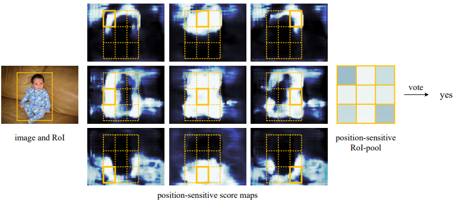

# Object Detection
## OverFeat (ILSVRC 2013)
[OverFeat: Integrated Recognition, Localization and Detection using Convolutional Networks](https://arxiv.org/abs/1312.6229)  
sliding windows + feature Extractor + multi-scale Classification

## R-CNN (CVPR 2014)
[Rich feature hierarchies for accurate object detection and semantic segmentation](https://arxiv.org/abs/1311.2524)  
Regions with CNN features  
1. generate region proposals by _Selective Search_, warpped to fixed size
2. embedding (one shot) features with CNN
3. detect & classify object by SVM
4. *adjust boundary box* by linear regression
### Bounding-Box Regression
``$`P=(P_x, P_y, P_w, P_h)`$``: the pixel corrdinates of the center of proposal together with width and height  
``$`G=(G_x, G_y, G_w, G_h)`$``: the ground-truth  
``$`\hat{G}`$``: predicted ground-truth  
``$`d_x(P), d_y(P)`$``: scale-invariant translation of P_x, P_y  
``$`d_w(P), d_h(P)`$``: log-space translation of P_w, P_h  
```math
\begin{split}
&\hat{G}_x=P_wd_x(P)+P_x\\
&\hat{G}_y=P_hd_y(P)+P_y\\
&\hat{G}_w=P_we^{d_w(P)}\\
&\hat{G}_h=P_he^{d_h(P)}
\end{split}
```
### Selective Search
[Selective Search for Object Recognition](http://www.huppelen.nl/publications/selectiveSearchDraft.pdf)  
Hierarchical Grouping Algorithm, merge from small segment to large proposal
### Non-Maximum Suppression, NMS
Post-processing to removes dupliicated detection for the same instance by [IoU](/CNN/object_detection/measurement#intersection-over-union-iou)

## SPP-net / SPPNet (TPAMI 2015)
[Spatial Pyramid Pooling in Deep Convolutional Networks for Visual Recognition](https://arxiv.org/abs/1406.4729)  
Previous model require a fixed-size input image.  
### Spatial Pyramid Pooling SPP
*spatial pyramid pooling layer* get fixed size output from flexible size input via adapting the step size  
Improve _Bag-of-Words (BoW)_ to maintain *spatial infomation* by pooling in _local spatial bins_. These spatial bins have sizes proportional to the image size, so the number of bins is fixed regardless of the image size.

## Fast R-CNN (ICCV 2015)
[Fast R-CNN](https://arxiv.org/abs/1504.08083)  
Previous model drawbacks:
> Training is a multi-stage pipeline that involves extracting features, fine-tuning a network with log loss, training SVMs. Fine-tuning algorithm cannot update the CNN that precede spatial pyramid pooling.  

Fast R-CNN: using fully connected classifer so it could also train the CNN features.  
Contributions:  
* Training is single-stage, using a multi-task loss
* Training can update all network layers

1. generate region proposals by _Selective Search_
2. embedding (one shot) features with CNN with flexible size input
3. bounding box regression
4. classification with fully connnected network
### RoI
> The RoI pooling layer uses max pooling to convert the features inside any valid region of interest into a small feature map with a fixed spatial extent of H × W. The RoI layer is simply the special-case of the spatial pyramid pooling layer used in SPPnets in which there is only one pyramid level.

## Faster R-CNN (NIPS 2015)
[Faster R-CNN: Towards Real-Time Object Detection with Region Proposal Networks](https://papers.nips.cc/paper/5638-faster-r-cnn-towards-real-time-object-detection-with-region-proposal-networks.pdf)  
  
### Region Proposal Network (RPN)
An RPN is a fully convolutional network that simultaneously predicts object bounds and objectness scores at each position with *anchor*. (RPN replace selective search to produce region proposal.)  

>>To generate region proposals, we slide a small network over the convolutional feature map output by the last shared convolutional layer. This small network takes as input an n × n spatial window of the input convolutional feature map. Each sliding window is mapped to a lower-dimensional feature (256-d for ZF and 512-d for VGG, with ReLU following). This feature is fed into two sibling fully connected layers—a box-regression layer (reg) and a box-classification layer (cls).
It shares full-image convolutional features with the detection network, thus enabling nearly cost-free region proposals.  
#### Anchors
>>At each sliding-window location, we simultaneously
predict multiple region proposals, where the number
of maximum possible proposals for each location is
denoted as k. So the reg layer has 4k outputs encoding
the coordinates of k boxes, and the cls layer outputs
2k scores that estimate probability of object or not
object for each proposal

## DenseBox (2015)
[DenseBox: Unifying Landmark Localization with End to End Object Detection](https://arxiv.org/abs/1509.04874)  
a unified end-to-end fully convolutional network that directly predicts bounding boxes and object class confidences through all locations and scales of an image, one-stage, anchor-free
### Detection
input: ``$`m\times n`$`` image  
the left top and right bottom points of the target bounding box: ``$`p_t=(x_t, y_t), p_b=(x_b, y_b)`$`` in output corrdinate space 
output: a ``$`\dfrac{m}{4}\times\dfrac{n}{4}`$`` feature map with 5 channels, ``$`\hat{t}_i=\{\hat{s}, \hat{dx^t} = x_i − x_t, \hat{dy^t} = y_i −y_t,\hat{dx^b} = x_i − x_b,\hat{dy^b} = y_i − y_b\}`$``  
``$`\hat{s}`$`` is confidence score  
``$`\hat{dx^t}, \hat{dy^t}, \hat{dx^b}, \hat{dy^b}`$`` is the distance between pixel i with boundary of target bounding box  
#### Multi-Level Feature Fusion
Upsampling so the feature map of high resolution also contains high level context information. (Similar to FPN)  
##### Receptive field (Object size)
DenseBox is designed for *small* scales and heavy occlusion.  
Receptive field is 48x48 (conv3_4) and 118x118 (conv4_4). 48x48 is said to be almost the same size of the face size, but it might be not large enough for other object detection.  
#### Multi-Task Training
landmark localization
##### Balance Sampling
###### Ignoring Gray Zone
###### Hard Negative Mining

## R-FCN (NIPS 2016)
[R-FCN: Object Detection via Region-based Fully Convolutional Networks](https://arxiv.org/abs/1605.06409)
based on RPN of Faster R-CNN  
Ideally, classification network should be translation invariance(shift of an object inside an image should be indiscriminative), while detection network should be translation variant. However, mapping RPN to vector is translation invariance.
**Position-sensitive score maps & Position-sensitive RoI pooling**: output ``$`k\times k \times (C+1)`$`` channels for ``$`k\times k`$`` grid


## MTCNN (2016)
[face_detection/MTCNN](face_detection.md#mtcnn-2016)

## UnitBox (ACM MM 2016)
[UnitBox: An Advanced Object Detection Network](https://arxiv.org/abs/1608.01471)  
* introduce a novel *Intersection over Union (IoU) loss function*
* adopts a fully convolutional network architecture, to predict the object bounds as well as the *pixel-wise classification scores* on the feature maps directly (concurrent work of DenseBox)

## SSD (ECCV 2016)
[SSD: Single Shot MultiBox Detector](https://arxiv.org/abs/1512.02325) from UNC Chapel Hill  
*One-stage*: detecting objects in images using a single deep neural network
> The core of SSD is predicting category scores and box offsets for *a fixed set of default bounding boxes using small convolutional filters applied to feature maps*
Or a multi-scale version YOLOv1  

1. Apply *anchor* boxes on different layers directly to extract features. Replace region proposal to increase speed.
2. dilated convolution to increase receptive field
3. data augmentation

* *faster* (59fps) since it is single shot (no proposal)  
Drawback: Difficult to detect small object since low level layer do not have high level feature  

### DSSD (2017)
[SSD: Deconvolutional Single Shot Detector](https://arxiv.org/abs/1701.06659) from UNC Chapel Hill  
shallow layers have less semantic information, use deconvolution to improve small object accuracy  
slower than SSD, cannot real-time

## YOLO (2015~)
* [YOLO](/CNN/object_detection/YOLO.md)  

## FPN (CVPR 2017)
[Feature Pyramid Networks for Object Detection](https://zpascal.net/cvpr2017/Lin_Feature_Pyramid_Networks_CVPR_2017_paper.pdf)
### Bottom-up pathway
ResNets  
### Top-down pathway and lateral connection
>The topdown pathway hallucinates higher resolution features by
upsampling spatially coarser, but semantically stronger, feature maps from higher pyramid levels. These features are
then enhanced with features from the bottom-up pathway
via lateral connections. Each lateral connection merges feature maps of the same spatial size from the bottom-up pathway and the top-down pathway. The bottom-up feature map
is of lower-level semantics, but its activations are more accurately localized as it was subsampled fewer times.


## Soft-NMS (ICCV 2017)
[Soft-NMS -- Improving Object Detection With One Line of Code](https://arxiv.org/abs/1704.04503)  
*Non-maximum suppression(NMS)*: 
>>The detection box M with the
maximum score is selected and all other detection boxes
with a significant overlap (using a pre-defined threshold)
with M are suppressed. This process is recursively applied
on the remaining boxes. As per the design of the algorithm,
if an object lies within the predefined overlap threshold, it
leads to a miss.

Soft-NMS decays the detection scores of all other objects as a continuous function of their overlap with M. Hence, no object is eliminated in this process.


## RefineNet (CVPR 2017)
[Segmentation/RefineNet](segmentation#refinenet-cvpr-2017)

## RetinaNet (ICCV 2017)
[Focal Loss for Dense Object Detection](https://arxiv.org/abs/708.02002)
### Focal Loss
* [Focal Loss](/CNN/object_detection/focal_loss.md)  
### Architecture
ResNet + [FPN](#FPN-cvpr-2017) + Box Subnet + Class Subnet

## FSAF(CVPR 2019)
[Feature Selective Anchor-Free Module for Single-Shot Object Detection](http://openaccess.thecvf.com/content_CVPR_2019/papers/Zhu_Feature_Selective_Anchor-Free_Module_for_Single-Shot_Object_Detection_CVPR_2019_paper.pdf)  
multi. anchor-free branch to cover more objects with different size  
### Feature Selective Anchor-Free Module, FSAF
addresses 2 limitations of anchor-based detection:
1. heuristic-guided feature selection
2. overlap-based anchor sampling
> The general concept of the FSAF module is online feature selection applied to the *training* of multi-level anchor-free branches.

## FCOS (ICCV 2019)
[FCOS: Fully Convolutional One-Stage Object Detection](https://arxiv.org/abs/1904.01355)  
[code](https://github.com/tianzhi0549/FCOS)
multi-level prediciton with FPN for FCOS loss with *centerness loss* to reduce low quality center  

<!--
## MatrixNet (ICCV 2019)
[Matrix Nets: A New Deep Architecture for Object Detection](https://arxiv.org/abs/1908.04646v2)  
[pyTorch](https://github.com/arashwan/matrixnet)
-->

## EfficientDet (CVPR 2020)
[EfficientDet: Scalable and Efficient Object Detection](https://arxiv.org/abs/1911.09070) from Google Brain  
[google/automl](https://github.com/google/automl/tree/master/efficientdet) | [pyTorch re-implementation](https://github.com/zylo117/Yet-Another-EfficientDet-Pytorch)  
One-stage detector with balance between accuracy and speed.
based on autoML result of NAS-FPN and EfficientNet  
### Backbone
employ [EfficientNets](/autoML/index.md#efficientnet-icml-2019) as backbone networks.
### BiFPN
[multi-scale feature representations/BiFPN](../multi-scale_feature_representations.html#bifpn)
### Compound Scaling 
using a single compound scaling factor to govern the depth, width, and resolution for all backbone, feature & prediction networks.  