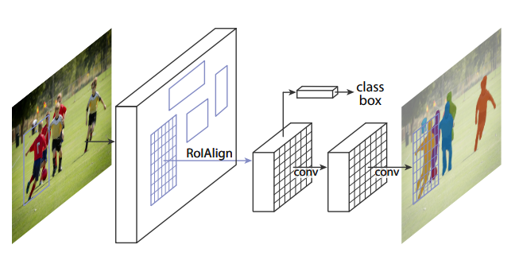
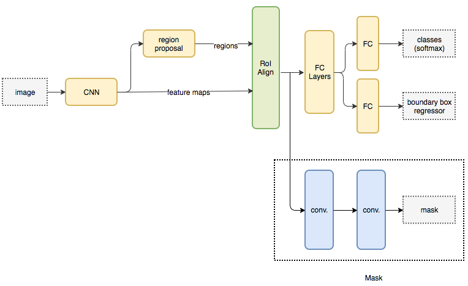
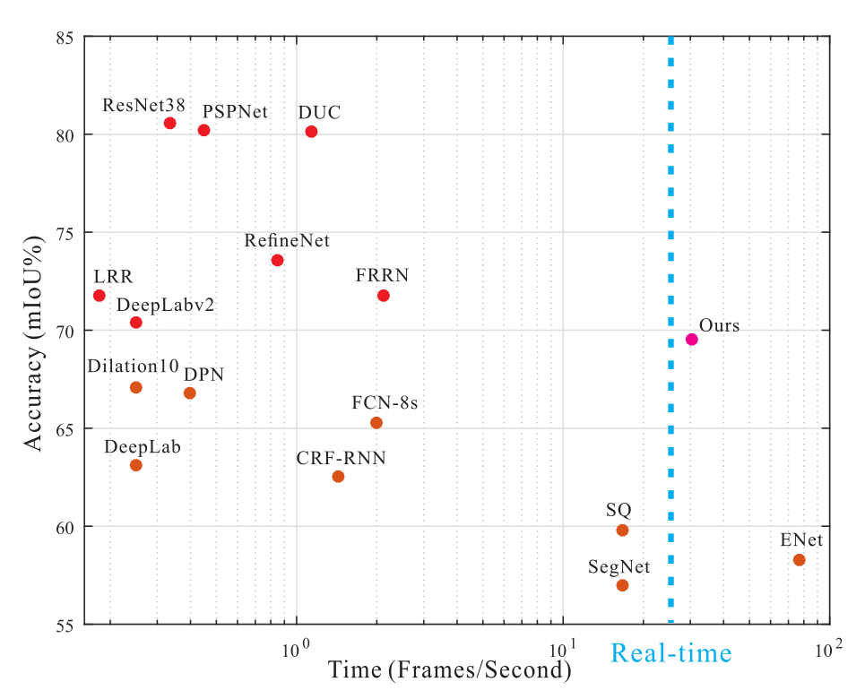

# Segmentation
pixel-wise labelling  
[干货 | 一文概览主要语义分割网络，FCN、UNet、SegNet、DeepLab 等等等等应有尽有](https://blog.csdn.net/qq_20084101/article/details/80432960)
## FCN (CVPR 2015)
[Fully Convolutional Networks for Semantic Segmentation](https://arxiv.org/abs/1411.4038)  
final output low-resolution feature map(heatmap) as segmentation, upsampling with deconvolution
backbone  VGG16

## SegNet (CVPR 2015)
[SegNet: A Deep Convolutional Encoder-Decoder Architecture for Robust Semantic Pixel-Wise Labelling](https://arxiv.org/abs/1505.07293)
[SegNet: A Deep Convolutional Encoder-Decoder Architecture for Image Segmentation](https://arxiv.org/abs/1511.00561)
[Project](https://mi.eng.cam.ac.uk/projects/segnet/)
unpooling: the decoder uses *pooling indices* computed in the max-pooling step of the corresponding encoder to perform non-linear upsampling

## U-net (MICCAI 2015)
[U-net](/CNN/models.html#u-net-miccai-2015)

## Mask R-CNN (ICCV 2017)
[Mask R-CNN](https://arxiv.org/abs/1703.06870)  
extends [Faster R-CNN](/CNN/object_detection/object_detection.html#faster-r-cnn-2015) by adding a branch for predicting segmentation masks on each Region of Interest  
  
  
code: [facebookresearch/Detectron](https://github.com/facebookresearch/Detectron2)

## DeepLab
### DeepLab v1 (ICLR 2015)
[Semantic Image Segmentation with deep convolutional nets and fully connected CRFs](https://arxiv.org/abs/1412.7062)
1. Dilated Convolution, aka Atrous Convolution
2. CRF post-process
### DeepLab v2 (TPAMI 2017)
[DeepLab: Semantic Image Segmentation with Deep Convolutional Nets, Atrous Convolution, and Fully Connected CRFs](https://arxiv.org/abs/1606.00915)  
Atrous Spatial Pyramid Pooling, ASPP
### DeepLab v3 (2017)
[Rethinking Atrous Convolution for Semantic Image Segmentation](https://arxiv.org/abs/1706.05587)
* MultiGrid
* Image-level feature

## PSPNet (CVPR 2017)
[Pyramid Scene Parsing Network](https://arxiv.org/abs/1612.01105)  
[Some](https://www.zhihu.com/question/53356671) said that it is difficult to re-product its result.  

## RefineNet (CVPR 2017)
[RefineNet: Multi-Path Refinement Networks for High-Resolution Semantic Segmentation](https://arxiv.org/abs/1611.06612)  
provides multiple paths over which information from different resolutions and via potentially long-range connections
### Multi-Path Refinement
divide pre-trained ResNet into 4 blocks and employ a 4-cascaed architecture with 4 RefineNet units.  
#### Residual Conv Unit + Multi-resolution Fusion
### Chained residual pooling

## ICNet (ECCV 2018)
[ICNet for Real-Time Semantic Segmentation on High-Resolution Images](https://arxiv.org/abs/1704.08545)  
real-time  

based on PSPNet
### Cascade Feature Fusion, CFF 
