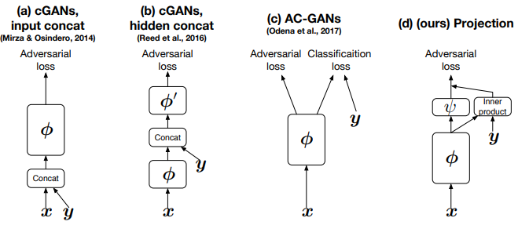
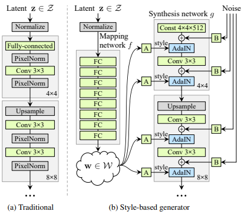

# Conditional / Repersentation of GAN
Apply condition, interactive/editing
## Representation Learning
Usage: 
1. Manipulate output of generative models
2. Transfer learning, embedding feature vector for other task (e.g. faceNet for face recognition, word2vec for NLP, VGG loss)

### Latent Space
Latent Space of encoder
#### Manipulation Process
input: unlabelled dataset to train encoder
1. Train encoder-decoder(e.g. AutoEncoder) with unlabelled dataset
2. Obtain average encoding of positive and negative inputs from labelled dataset
3. Get manipulation vector by taking difference
4. Manipulate new x_input along z_manipulate

## Conditional GAN
[Conditional Generative Adversarial Nets (CoRR 2014)](https://arxiv.org/abs/1411.1784) by Mehdi Mirza, Simon Osindero  
Apply GAN by learning conditions (supervised)  

  
Applications shown in paper: genetarte MNIST digits (from noise+condition that specified digit number) & image tagging  
Image-to-image translation model like pix2pix could be considiered conditional GAN, with image input as condition.  

## InfoGAN
[InfoGAN: Interpretable Representation Learning by Information Maximizing Generative Adversarial Nets (NIPS 2016)](https://arxiv.org/abs/1606.03657)
Apply GAN with learning conditions

## iGAN
[**i**nteractive **GAN**: Generative Visual Manipulation on the Natural Image Manifold (ECCV 2016)](https://arxiv.org/abs/1609.03552) - Adobe  
[Project](http://efrosgans.eecs.berkeley.edu/iGAN/) | [Theano](https://github.com/junyanz/iGAN)  
>  learn the natural image manifold directly from data using a generative adversarial neural network. We then define a class of image editing operations, and constrain their output to lie on that learned manifold at all times.

architecture based on [DCGAN](#dcgan-iclr-2016)

###  Manipulating the Latent Vector
Each editing operation is formulated as a constraint `$f_g(x)=v_g$`, g include color, shape and warping constraints  
given an initial projection `$x_0$`, find a new image x close to `$x_0$` trying to satisfy as many constraint as possible via **Gradient descent update** (just like style-transfer, training 1 model for specified loss)  

### Applications
1. Manipulating an existing photo based on an underlying generative model to achieve a different look (shape and color);
1. “Generative transformation” of one image to look more like another; 
1. Generate a new image from scratch based on user’s scribbles and warping UI.
feature mapping, mini-batch discrimination  

## ACGAN
[Conditional Image Synthesis With Auxiliary Classifier GANs (ICML 2017)](https://arxiv.org/abs/1610.09585)

## Projection Discriminator
[cGANS with Projection Discriminator (ICLR 2018)](https://openreview.net/pdf?id=ByS1VpgRZ)  
incorporate the conditional information into the discriminator in *projection based* way to improve quality of the class conditional image generation.
[code](https://github.com/pfnet-research/sngan_projection)

## StyleGAN
[A Style-Based Generator Architecture for Generative Adversarial Networks (CVPR 2019)](https://arxiv.org/abs/1812.04948) by Nvidia  
[links](https://nvlabs.github.io/stylegan2/versions.html)
The generator starts from a learned constant input and adjusts the “style” of the image at **each convolution layer based on the latent code**, therefore directly controlling the strength of image **features at different scales**.

<iframe src="https://www.youtube.com/embed/kSLJriaOumA" frameborder="0" allow="accelerometer; autoplay; encrypted-media; gyroscope; picture-in-picture" allowfullscreen></iframe>

### StyleGAN2
[Analyzing and Improving the Image Quality of StyleGAN](https://arxiv.org/abs/1912.04958)  
<iframe src="https://www.youtube.com/embed/c-NJtV9Jvp0" frameborder="0" allow="accelerometer; autoplay; encrypted-media; gyroscope; picture-in-picture" allowfullscreen></iframe>

## StyleALAE
Model of [antoencoder/ALAE](/generative_models/autoencoder.html#alae)  
apply VAE on StyleGAN to enable *manipulations based on real images*, while previous generative GAN manipulate with generated images only.

## Deep Generative Prior
[Exploiting Deep Generative Prior for Versatile Image Restoration and Manipulation (ECCV 2020)](https://www.ecva.net/papers/eccv_2020/papers_ECCV/papers/123470256.pdf)  
[Youtube](https://youtu.be/p7ToqtwfVko?t=122) | [pyTorch >=1.0.1](https://github.com/XingangPan/deep-generative-prior) | [ECCV2020 Oral | Deep Generative Prior：实现通用的图像复原与编辑 - 知乎](https://zhuanlan.zhihu.com/p/165050802)  
main idea: relax [GAN-Inversion, e.g. iGAN](#igan) so that generator can be **fine-tuned** among with latent vector. iGAN latent space limited, precision might not enough. Fine-tuning generator increase precision.  
1. Feature matching loss from the coupled discriminator
1. Progressive reconstruction: fine-tunes the generator gradually from the shallowest layers(high level configuration) to the deepest layers(texture) to preserve image prior
  
