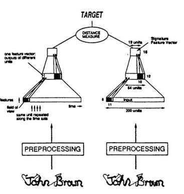

# Basic models
## Restricted Boltzann Machine, RBM
shallow, 2 layer neural networks. First is visible layer, second is hidden layer with sigmoid.  
probabilistic graphical model models the distribution of data p(x) (not using backpropagation)
Get embedding from hidden layer  

### Deep Belief Network, DBN (2009)
Stacking unsupervised network (RBMs/autoencoders)
Add classifier  (semi-supervisied, layer-wise pre-training)  
The initial weighting is better-> solve local minimum
application: classification, collaborative filtering, feature learning
(better improve activation function, rarely use now)

## Multi. layers perceptron(MLP)

## CNN (convolutional neural network)
[CNN](/CNN/index.md)

## RNN
[RNN](/RNN/index.md)

## Generative Models
[Generative Models](/generative_models/index.md)

## Siamese network (IJPRAI 1993)
[Signature Verification using a "Siamese" Time Delay Neural Network](https://papers.nips.cc/paper/769-signature-verification-using-a-siamese-time-delay-neural-network.pdf)
孿生網路  
usually used for comparison  
  
e.g. facenet (with triplet loss, i.e. 3 inputs), DaSIAMPRN

## 3D convolution
[3D Convolutional Neural Networks for Human Action Recognition](http://citeseerx.ist.psu.edu/viewdoc/download?doi=10.1.1.442.8617&rep=rep1&type=pdf)
change color into frame