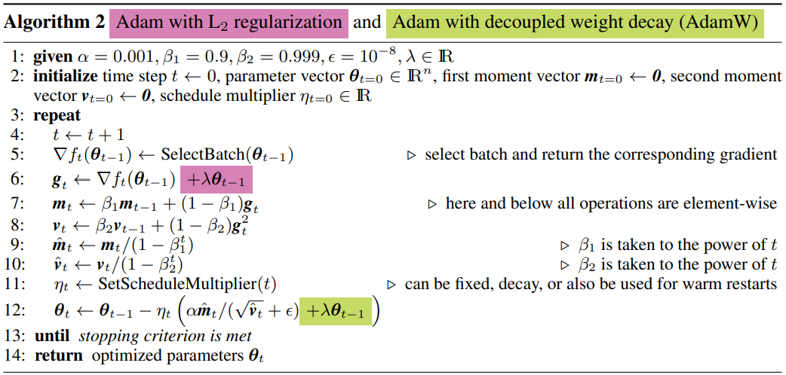

# Optimizer
## Gradient Descent
```math
\theta_t \leftarrow \underbrace{\theta_{t-1}}_{\text{model weight at timestep t-1}} - \overbrace{\eta}^{\text{learning rate}} \underbrace{\nabla_\theta L(\theta_{t-1})}_{\text{gradient of loss function}}
```
### Trade-off between accuracy and time to update
1. Batch gradient descent
1. Stochastic gradient descent, SGD
1. Mini-batch gradient descent

## Momentum
Momentum add add a fraction `$\gamma$` of the update factor
```math
v_t      & \leftarrow \gamma v_{t-1}+\eta \nabla_\theta L(\theta_{t-1}) \\
\theta_t & \leftarrow \theta_{t-1} - v_t
```
### Second-order

## AdaGrad
[**Ada**ptive Subgradient Methods for Online Learning and Stochastic Optimization (JMLR 2011)](http://www.jmlr.org/papers/volume12/duchi11a/duchi11a.pdf)  
adaptively tune learning rate based on the previous gradient
```math
g_t      & \leftarrow \nabla_\theta L(\theta_{t-1}) \\
G_t      & \leftarrow \sum^t_{\tau=1} g_\tau g_\tau^T = \sum^t_{\tau=1} g^2_\tau \\
\theta_t & \leftarrow \theta_{t-1} - \underbrace{\frac{\eta}{\sqrt{G_t+\epsilon}}}_{\text{adaptive learning rate}} \nabla_\theta L(\theta_{t-1})
```
If the gradient of weight always small, amplify the learning rate. 
If the gradient of weight always large, decrease the learning rate. 
works well for sparse gradients  
weakness: learning rate shrink to zero

## AdaDelta
[ADADELTA: An Adaptive Learning Rate Method (2012)](https://arxiv.org/abs/1212.5701)  
simplify AdaGrad to overcome the continual decay of learning rate 

Accumulate over window (moving average) `$E[x]_t=\rho E[x]_{t-1}+(1-\rho)x_t$`  
Root Mean Square: `$ RMS[x]_t = \sqrt{E[x^2]_t+\epsilon} $`
```math
\Delta x_t \leftarrow - \frac{RMS[\Delta x]_{t-1}}{RMS[g^2]_t} g_t \propto \text{unit of }x
```    
## RMSprop
**R**oot **M**ean **S**quare **Prop**agation, concurrent work of AdaDelta
```math
E[x]_t=0.9 E[x]_{t-1}+0.1 x_t \\
\Delta x_t \leftarrow - \frac{\eta}{RMS[g^2]_t} g_t
```
## Adam
[Adam: A Method for Stochastic Optimization (ICLR 2015)](https://arxiv.org/abs/1412.6980)  
**Ada**ptive **M**omentum  
RMSProp + Momentum + running average + bias-correction  
```math
g_t &\leftarrow \nabla_\theta L(\theta_{t-1})\\
m_t &\leftarrow \beta_1 \cdot m_{t-1}+(1-\beta_1) \cdot g_t \text{(Update biased first moment estimate)}\\
u_t &\leftarrow \beta_2 \cdot v_{t-1}+(1-\beta_2) \cdot g^2_t\text{(Update biased second raw moment estimate)}\\
\hat{m}_t &\leftarrow \frac{m_t}{1-\beta^t_1} \text{ (bias-corrected)}\\
\hat{v}_t &\leftarrow \frac{v_t}{1-\beta^t_2} \text{ (bias-corrected)}\\
\theta_t &\leftarrow \theta_{t-1} - \alpha \cdot \frac{\hat{m}_t}{\sqrt{\hat{v}_t+\epsilon}}
```
#### AdaMax
```math
m_t &\leftarrow \beta_1 \cdot m_{m-1}+(1-\beta_1) \cdot g_t \text{(Update biased first moment estimate)}\\
u_t &\leftarrow max(\beta_2 \cdot u_{t-1}, |g_t|) \text{(Update the exponentially weighted infinity norm)}\\
\theta_t &\leftarrow \theta_{t-1} - \frac{\alpha}{1-\beta^t_1}\cdot \frac{m_t}{v_t}
```
#### Drawback
[The Marginal Value of Adaptive Gradient Methods in Machine Learning (NIPS 2017)](https://arxiv.org/pdf/1705.08292.pdf) suggest use SGD(+momentum) over adaptive methods (AdaGrad, RMSProp, and Adam). Adam is fast but generalize worse than fine-tuned SGD.
[reddit discussion](https://www.reddit.com/r/MachineLearning/comments/6d0p7h/r_the_marginal_value_of_adaptive_gradient_methods/) 

## AdamW
[Decoupled Weight Decay Regularization (ICLR 2019)](https://arxiv.org/pdf/1711.05101.pdf)  
* **`$L_2$` regularization and weight decay are not identical.** The two techniques can be made equivalent for SGD by a reparameterization of the weight decay factor based on the learning rate; however, as is often overlooked, this is not the case for Adam. In particular, when combined with adaptive gradients, L2 regularization leads to weights with large historic parameter and/or gradient amplitudes being regularized less than they would be when using weight decay.  
* **`$L2$` regularization is not effective in Adam.** One possible explanation why Adam and other adaptive gradient methods might be outperformed by SGD with momentum is that common deep learning libraries only implement L2 regularization, not the original weight decay. Therefore, on tasks/datasets where the use of L2 regularization is beneficial for SGD (e.g., on many popular image classification datasets), Adam leads to worse results than SGD with momentum (for which L2 regularization behaves as expected).
* **Weight decay is equally effective in both SGD and Adam.** For SGD, it is equivalent to L2 regularization, while for Adam it is not. 
* **Optimal weight decay depends on the total number of batch passes/weight updates.** Our empirical analysis of SGD and Adam suggests that the larger the runtime/number of batch passes to be performed, the smaller the optimal weight decay.
* **Adam can substantially benefit from a scheduled learning rate multiplier.** The fact that Adam is an adaptive gradient algorithm and as such adapts the learning rate for each parameter does not rule out the possibility to substantially improve its performance by using a global learning rate multiplier, scheduled, e.g., by cosine annealing.



## Cyclical Learning Rates
[Cyclical Learning Rates for Training Neural Networks (WACV 2017)](https://arxiv.org/abs/1506.01186)  
Instead of monotonically decreasing the learning rate, this method lets the learning rate cyclically vary between reasonable boundary values  
soft restart  
### LR Range test 
ractically eliminates the need to experimentally find the best values and schedule for the global learning rates  
Note: Even though some said the performance of cyclical learning rate is not significant, the concept of LR range test used for other cycle/restart based optimizer

## SGDR
[SGDR: **S**tochastic **G**radient **D**escent with Warm **R**estarts (ICLR 2017)](https://arxiv.org/abs/1608.03983)  
SGD with cosine annealing hard restart  
avoid local minimium, useful in many model, e.g. EDVR use Adam Optimizer with SGDR as learning rate scheduler
