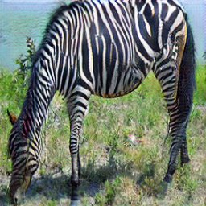
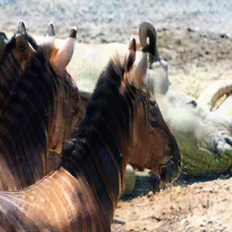
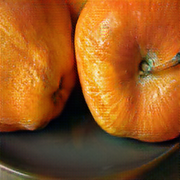
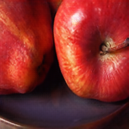
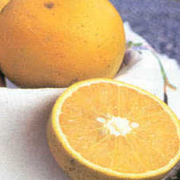
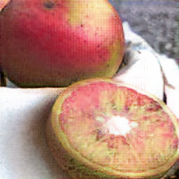
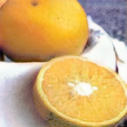
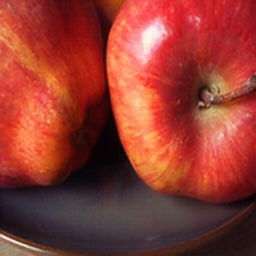

# MMD(CG) -> Anime
[CycleGAN](/generative_models/GAN_image2image.html#cyclegan-iccv-2017)

## Custom dataset that I want to play with
MMD -> human drawed Anime
TODO: need to collect data and parse frame...how much sample is needed? how to handle resolution?
play with cycleGAN's dataset and have a taste first...
## Trying cycleGAN's dataset
sadly I only have a poor RTX 2070, which only could fit 2 batch.
### horse2zebras
Tried pyTorch CycleGAN (Python 3 + pyTorch 1.4) to run horse2zebras, superisingly good :D  Expecially horse2zebras.  

-29/03/2020
zebras2horse is relatively bad comparing to horse2zebras, probably because generator try to keep zebras detail? If continus training, the generator of zebras2horse will try to encode the striped coats into somewhere imperceptible to human (and discriminator based on the loss function)?  
There is a paper already discussing this issue: [CycleGAN, a Master of Steganography](https://arxiv.org/abs/1712.02950)  
-31/03/2020
### apple2orange
horse2zebras have almost same shape, what if dataset have different shape? try apple2orange and see if how well cycleGAN could modifiy the shape...
trained 200 epoch, only change color, fail to change shape or inside...  

|real|fake|rec|idt|
|---|---|---|---|
|||||
|||||

continue training with more epochs ...
Btw, there is some weird apple in the dataset...  

  
Might clean the dataset and re-train later, have a look of the result with above images first.
-31/03/2020  

### possible improvements
for let GAN drop unnessary info, learn to train shape instead of color only.

[GANで犬を猫にできるか~cycleGAN編(1)~](https://qiita.com/itok_msi/items/b6b615bc28b1a720afd7#%E8%BF%BD%E5%8A%A0%E5%AE%9F%E9%A8%93%E7%B5%90%E6%9E%9C20170614%E8%BF%BD%E8%A8%987)
tok_msi produced cats ↔ dogs CycleGAN results with a local+global discriminator and a smaller cycle loss.
Seems useful, sadly I cannot read Japenese :(

Well just collect some possible improvement based on above obversations, review and later improvement paper.
1. reduce the cycle consistency loss
2. add the discriminator (original) output as loss
3. perceptual loss, e.g. VGG
4. global + local discriminator
5. Self-attention

## TODO experiments
* train cycleGAN in patch manner
* train cycleGAN with small / middle size, so that the receptive field can get more sense of whole image  
* apply super-resolution on above output

With limited GPU resource, is it possible to train a low-resolution cycleGAN, then drop the second generator-discriminator pair to free memory, and use [progressive GAN](/generative_models/GAN_image2image.html#progressive-gan-iclr-2018)/ [pix2pixHD](/generative_models/GAN_image2image.html#pix2pixhd-cvpr-2018) growing method to increase resolution?

* pretrained small cycleGAN + pix2pixHD growing
* pretrained small cycleGAN + progressive GAN growing
- 26/03/2020
