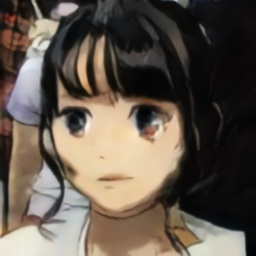
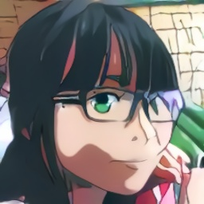
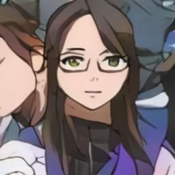
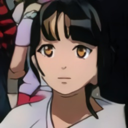
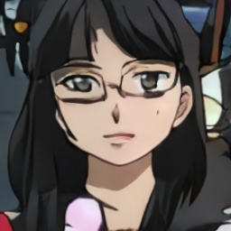
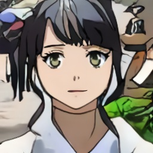
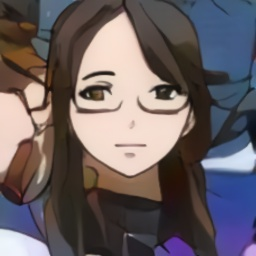

# Some Anime related papers
Here collect projects related to anime / anime face. The main focus is fun rather than novel contribution.
## CartoonGAN (CVPR 2018)
[CartoonGAN: Generative Adversarial Networks for Photo Cartoonization](http://openaccess.thecvf.com/content_cvpr_2018/papers/Chen_CartoonGAN_Generative_Adversarial_CVPR_2018_paper.pdf)
  
> In this paper, we propose a solution to transforming photos of *real-world scenes* into cartoon style images  
(1) cartoon styles have unique characteristics with high level **simplification** and abstraction, and (2) cartoon images tend to have **clear edges**, smooth color shading and relatively simple textures, which exhibit significant challenges for texture-descriptor-based loss functions 
Two novel losses suitable for cartoonization are proposed:  
(1) a **semantic content loss**, which is formulated as a sparse regularization in the high-level feature maps of the VGG network to cope with substantial style variation between photos and cartoons, and  
(2) an **edge-promoting adversarial loss** for preserving clear edges.  
We further introduce an **initialization phase**, to improve the convergence of the network to the target manifold.

## MakeGirlsMoe
[Towards the Automatic Anime Characters Creation with Generative Adversarial Networks](https://arxiv.org/abs/1708.05509)
[MakeGirlsMoe](https://make.girls.moe/)

## Selfie2Anime
[blog: Iterating on an idea](https://selfie2anime.com/blog/iterating-on-an-idea/)  
U-GAT-IT(ICLR 2020): [U-GAT-IT: Unsupervised Generative Attentional Networks with Adaptive Layer-Instance Normalization for Image-to-Image Translation](https://arxiv.org/abs/1907.10830), [tensorflow](https://github.com/taki0112/UGATIT), [pyTorch](https://github.com/znxlwm/UGATIT-pytorch)

[selfie2anime site](https://selfie2anime.com)
找了4張照片玩玩看  

  
1: 臉形blur  
1,2: 眼睛不太對稱，動漫的大眼睛比較難維持結構吧。中二病異色瞳XD  
3: 側面失敗了，沒了一只眼  
4: 在這照片中,我髮尾染了紫藍色。我本身想着動漫多彩色頭髮，不過好像辨認不出藍色部份(也許被我的黑色衣服影響了)，直接斷開了。線條很分明。可惜沒有其他我染髮期間的照片。(這張是在>20人的家庭聚會截出來......)  
整體上髮型保持得很好。我算是比較幸運了，demo的sample比我還要奇怪  
雖然圖2出了藍紫異色瞳，但整體雙眼的顏色是相近的。  
P.S. 大概因為dataset多女, 女生效果比男生好。讓男友試一下，徹底悲劇了。
## Selfie2WaiFu
[Selfie2WaiFu](https://waifu.lofiu.com/index.html)  
Based on U-GAT-IT *official* pretrain model.  

  
Selfie2WaiFu 自動檢測人臉, 圖3把背景的竹當成人臉，玩不了。  
個人感覺WaiFu畫風比較古早，線條較實，眼睛沒有崩，但眼睛以外的物件(眼鏡框, 頭髮)Selfie2Anime完整些。

## Waifu Labs
[Waifu Labs](https://waifulabs.com/)
Quality of image is very high
repeatedly pick 1 image from 16 grid
I guess it is like StyleGAN? After picking 1 image, randomly generate 16 noise for the next feature and append to picked image.

## This WaiFu does not exist
[This WaiFu does not exist](https://www.thiswaifudoesnotexist.net/)  
[Making Anime Faces With StyleGAN](https://www.gwern.net/Faces)