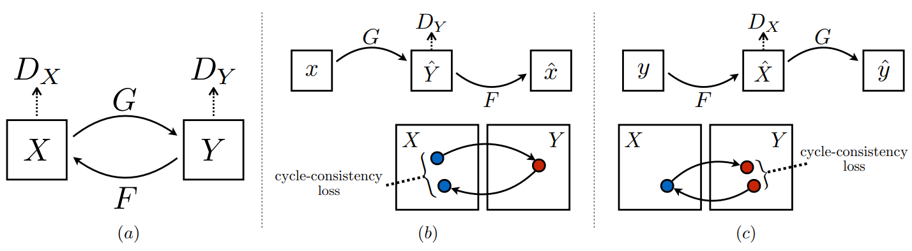
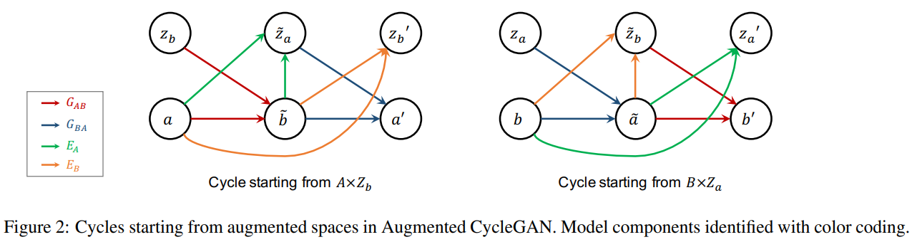
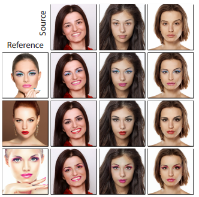
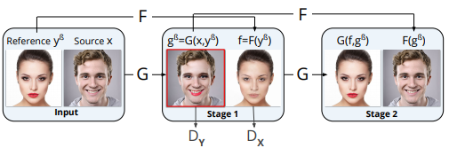
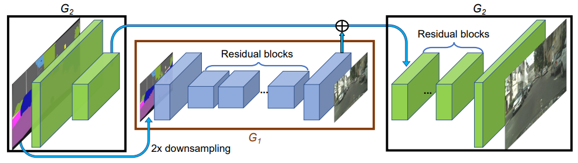

# image-to-image

## pix2pix (CVPR 2017)
[Image-to-Image Translation with Conditional Adversarial Networks](https://arxiv.org/abs/1611.07004) by Phillip Isola, Jun-Yan Zhu, Tinghui Zhou, Alexei A. Efros  
[https://phillipi.github.io/pix2pix/](https://phillipi.github.io/pix2pix/) | 
[Image-to-Image Demo](https://affinelayer.com/pixsrv/)
based on [conditional GAN](/generative_models/GAN_repersentation_learning.html#conditional-gan-2014), with image as conditional&noise input  

dataset: paired image (supervised), e.g. segmentation/edge/map -> real photo, real photo → map
discriminator: PatchGAN which also take conditional as pairs 

## LAPGAN (NIPS 2015)
[Deep Generative Image Models using a Laplacian Pyramid of Adversarial Networks](https://arxiv.org/abs/1506.05751)  
aim for **high-resolution** image via using low-resolution image as condition, similar to residual learning
> In this paper we introduce a **generative parametric model** capable of producing high quality samples of natural images. Our approach uses **a cascade of convolutional networks** within a **Laplacian pyramid framework** to generate images in a coarse-to-fine fashion. 
Note: Could I consider it as GAN plus residual+GAN based super-resolution?

## DTN (ICLR 2017)
[Unsupervised Cross-Domain Image Generation](https://arxiv.org/abs/1611.02200)  
Domain Transfer Network(DTN)  
### Identity Loss
first proposed in Equation 6 of this paper  
> The generator trained with this loss will often be more conservative for unknown content. -- from CycleGAN FAQ

## CycleGAN (ICCV 2017)
[Unpaired Image-to-Image Translation using Cycle-Consistent Adversarial Networks](https://arxiv.org/abs/1703.10593) by Jun-Yan Zhu, Taesung Park, Phillip Isola, Alexei A. Efros  
[Project](https://junyanz.github.io/CycleGAN/)| 
[Torch](https://github.com/junyanz/CycleGAN) | 
[pyTorch](https://github.com/junyanz/pytorch-CycleGAN-and-pix2pix) | 
[CVPR2018 slides](http://efrosgans.eecs.berkeley.edu/CVPR18_slides/CycleGAN.pdf)  
Could be applyed on any **unapired** datasets (better if two datasets share similar visual content)  

## Augmented CycleGAN (ICML 2018)
[Augmented CycleGAN: Learning Many-to-Many Mappings from Unpaired Data](https://arxiv.org/abs/1802.10151)  
[pyTorch (Python2, pyTorch 0.3)](https://github.com/aalmah/augmented_cyclegan) | [Theano re-implementation](https://github.com/justanhduc/AugmentedCycleGAN)  

Apart from generator, also have 2 encoders ``$`E_A: A \times B → Z_a, E_B: B \times A → Z_b`$`` which enable optimization of cycle-consistency with stochastic, structured mapping  

## Paired CycleGAN (CVPR 2018)
[PairedCycleGAN: Asymmetric Style Transfer for Applying and Removing Makeup](https://adoberesearch.ctlprojects.com/wp-content/uploads/2018/04/CVPR2018_Paper3623_Chang.pdf)  
Could apply specified style from input_reference to input_source, as a one-to-many transformation  
 
pre-train makeup removal function F(many-to-one) with CycleGAN first, then alternate the training of makeup transfer function G (one-to-many)

## StarGAN (CVPR 2018)
## ComboGAN (CVPR 2018)

## Progressive GAN (ICLR 2018)
[Progressive Growing of GANs for Improved Quality, Stability, and Variation](https://arxiv.org/pdf/1710.10196.pdf) by Nvidia  
[Official TensorFlow implementation](https://github.com/tkarras/progressive_growing_of_gans) | [PyTorch implenetation (unofficial)](un-official)  
### Growing
resize + w * conv, increase weighting of convolution to fade smoothly  
fully integrate previous learning result into bigger model  
### Result
<iframe src="https://www.youtube.com/embed/XOxxPcy5Gr4" frameborder="0" allow="accelerometer; autoplay; encrypted-media; gyroscope; picture-in-picture" allowfullscreen></iframe>
### Compare with LAPGAN
LAPGAN learning residual, Progressive GAN learn image

## pix2pixHD (CVPR 2018)
[High-Resolution Image Synthesis and Semantic Manipulation with Conditional GANs](https://arxiv.org/pdf/1711.11585.pdf) by Nvidia + author of pix2pix  
[Project](https://tcwang0509.github.io/pix2pixHD/)
> We present a new method for synthesizing **high-resolution photo-realistic** images from semantic label maps using conditional generative adversarial networks (conditional GANs). Conditional GANs have enabled a variety of applications, but the results are often limited to low-resolution and still far from realistic. In this work, we generate 2048x1024 visually appealing results with a **novel adversarial loss**, as well as new **multi-scale** generator and discriminator architectures. Furthermore, we *extend* our framework to *interactive visual manipulation* with two additional features. First, we incorporate object instance segmentation information, which enables object manipulations such as removing/adding objects and changing the object category. Second, we propose a method to generate diverse results given the same input, allowing users to edit the object appearance interactively. Human opinion studies demonstrate that our method significantly outperforms existing methods, advancing both the quality and the resolution of deep image synthesis and editing.

### Coarse2fine Generator
### Compare with Progressive GAN
* The main idea of both 2 paper is grow the GAN after training low-resolution. Training small generator first, then use a bigger generator include the small generator.  
* pix2pixHD is supervised/conditional while Progressive GAN is un-supervised. pix2pixHD have a encoder in generator while Progressive GAN start with latent input.
* pix2pixHD is handle low-resolution image feature as residual. Progressive GAN fade-out the previous small model and let the big model continus learning the weight.
* When inference with final model, pix2pixHD input high resolution input image + resized low resolution input image(s). Progressive GAN input size remain (latent random noise).  
Question: What if growing network like Progressive GAN (fade) instead of residual for conditional GAN? Sadly the requirement of training Progressive GAN is high (8 Tesla V100 ;\_;)

## vid2vid (NIPS 2018)
(put in this section because I consider video as sequence of images)
[Video-to-Video Synthesis (Arxiv)](https://arxiv.org/abs/1808.06601) | 
[Video-to-Video Synthesis](https://tcwang0509.github.io/vid2vid/) | 
[github](https://github.com/NVIDIA/vid2vid) - by Nvidia (Includes works of pix2pixHD and SPADE)

## GauGAN
### SPADE (CVPR 2019)
[Semantic Image Synthesis with Spatially-Adaptive Normalization](https://arxiv.org/abs/1903.07291) by Nvidia  
### Project
[Live Interactive Demos](https://www.nvidia.com/en-us/research/ai-playground/) | 
[Project](https://arxiv.org/abs/1903.07291) | 
[blog](https://blogs.nvidia.com/blog/2019/03/18/gaugan-photorealistic-landscapes-nvidia-research/)
<iframe width="1173" height="660" src="https://www.youtube.com/embed/p5U4NgVGAwg" frameborder="0" allow="accelerometer; autoplay; encrypted-media; gyroscope; picture-in-picture" allowfullscreen></iframe>

## Spectral Regularization (CVPR 2020)
[Watch your Up-Convolution: CNN Based Generative Deep Neural Networks are Failing to Reproduce Spectral Distributions](https://arxiv.org/pdf/2003.01826.pdf)  
> Generative convolutional deep neural networks, e.g. popular GAN architectures, are relying on convolution based up-sampling methods to produce non-scalar outputs like images or video sequences. In this paper, we show that **common up-sampling methods, i.e. known as upconvolution or transposed convolution, are causing the inability of such models to reproduce spectral distributions of natural training data** correctly. This effect is independent of the underlying architecture and we show that it can be used to easily detect generated data like deepfakes with up to 100% accuracy on public benchmarks. To overcome this drawback of current generative models, we propose to add a novel **spectral regularization** term to the training optimization objective. We show that this approach not only allows to train spectral consistent GANs that are avoiding high frequency errors. Also, we show that a correct approximation of the frequency spectrum has positive effects on the training stability and output quality of generative networks.