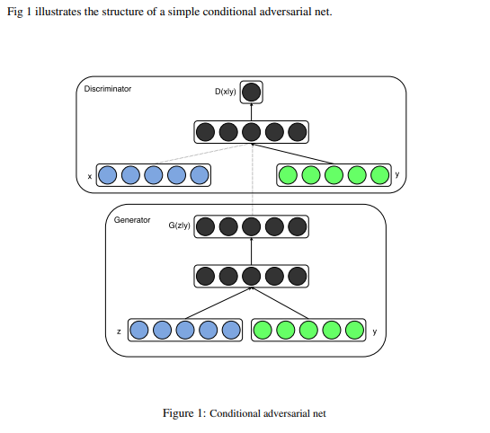

# Repersentation Learning with GAN
Apply condition, interactive/editing
### Conditional GAN (2014)
[Conditional Generative Adversarial Nets](https://arxiv.org/abs/1411.1784) by Mehdi Mirza, Simon Osindero  
Apply GAN by learning conditions (supervised)  

application in paper: genetarte MNIST digits (from noise+condition) & image tagging
variants: 
* pix2pix (GAN with image condition)
* cycleGAN
* BicycleGAN

### DCGAN (2015)
[Unsupervised Representation Learning with Deep Convolutional Generative Adversarial Networks](https://arxiv.org/abs/1511.06434)
stabilize the training with some architectural constraints.
* Replace any pooling layers with strided convolutions (discriminator) and fractional-strided convolutions (generator). 
* Use batch normalization in both the generator and the discriminator. 
* Remove fully connected hidden layers for deeper architectures. 
* Use ReLU activation in generator for all layers except for the output, which uses Tanh. 
* Use LeakyReLU activation in the discriminator for all layers. 
Applications:
vector arithmetic on face samples and control of bedroom (repersentation learning)
⇒ improvement: WGAN

### InfoGAN (NIPS 2016)
[InfoGAN: Interpretable Representation Learning by Information Maximizing Generative Adversarial Nets](https://arxiv.org/abs/1606.03657)
Apply GAN by learning conditions (unsupervised)

### iGAN (2016~2017)
[Generative Visual Manipulation on the Natural Image Manifold](https://arxiv.org/abs/1609.03552)  
feature mapping, mini-batch discrimination  
application: manipulate visual content in a user-controlled fashion  