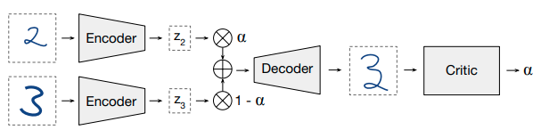

# AutoEncoder
## AutoEncoder, AE
[Autoencoder-Deep Learning](https://www.deeplearningbook.org/contents/autoencoders.html)  
Applications:
1. Dimensionality reduction [Reducing the dimensionality of data with neural networks (Science 2006)](https://dbirman.github.io/learn/hierarchy/pdfs/Hinton2006.pdf)  
2. Information retrieval via **semantic hashing**: produce a code that is low-dimensional and binary, then stored in hash table. 1. easily return entries with same binary code and search similar (or less similar) entries efficiently
3. Denoising, inpaint task

## VAE
[Auto-encoding variational bayes (ICLR 2014)](https://arxiv.org/abs/1312.6114)  
How to apply autoencoder to generative task like GAN? **V**ariantional **A**uto**E**ncoder
* enforce the posterior distribution of latent representation `$p(z|x)$` follows standard distribution
* encoder (MLP) compute mean vector `$\mu$` and standard deiation vector `$\sigma$`, combine them to sampled latent vector `$z$`
```math
\tilde{L}(\theta, \Phi;x^{(i)}) = 
\overbrace{
- D_{KL}(q_\Phi(z|x^{(i)}) \parallel p_\theta(z))
}^{\text{the KL divergence of the approximate posterior from the prior, acts as a regularizer}}
+
\overbrace{
\frac{1}{L}\sum^L_{l=1}(log p_\theta(x^{(i)}|z^{(i,l)}))
}^{\text{the expected negative reconstruction error}}
```

### Re-parameterization Trick
adding noise that follow standard distribution to latent space in order to backpropagate through a random node
```math
z=\mu+\sigma \epsilon \text{ , where }\epsilon \text{ is an auxiliary noise variable }\epsilon \sim N(0, 1)
```
result: improve latent space that not accessable with samples in dataset
 from [Understanding Variational Autoencoders (VAEs) - Towards Data Science](https://towardsdatascience.com/understanding-variational-autoencoders-vaes-f70510919f73)
### Inference
random generate latent representation `$z$` that follows sample distribution `$log q_\phi(z|x^{(i)})=log N(z;μ^{(i)},σ^{2(i)}I)$`, then use decoder to generate output

### VAE comparing with GAN
#### Disadvantage
* usually blurry generated image
* posterior collapse: the latents are ignored when they are paired with a powerful autoregressive decoder
#### Advantage
* cover all modes of the data, and do not suffer from the problems of mode collapse and lack of diversityseen in GANs

### Other Explaination
* [变分自编码器（一）：原来是这么一回事 - 科学空间|Scientific Spaces](https://spaces.ac.cn/archives/5253)
* [Taming VAEs](https://arxiv.org/pdf/1810.00597.pdf)
* [Understanding and Improving Interpolation in Autoencoders via an Adversarial Regularizer](https://arxiv.org/abs/1807.07543)

## CVAE
Conditional VAE
[Learning Structured Output Representation using Deep Conditional Generative Models (NIPS 2015)](https://papers.nips.cc/paper/5775-learning-structured-output-representation-using-deep-conditional-generative-models.pdf)

<!--
## AAE
[Adversarial Autoencoders (2015)](https://arxiv.org/abs/1511.05644)
was submitted to ICLR 2016 workshop ..?
[reddit: How is Adversarial AutoEncoder different from Autoencoding Beyond Pixels using a Learned Similarity Metric (VAE/GAN) ?](https://www.reddit.com/r/DeepLearningPapers/comments/571zri/how_is_adversarial_autoencoder_different_from/)
> AAE uses an adversarial procedure to enforce the gaussian prior on the latents of an autoencoder (which is enforced through a KL divergence in the variational setting), while VAE/GAN tacks a GAN discriminator onto the end of a VAE and uses it as a replacement for the reconstruction error (normally MSE or similar).
-->

## VAE-GAN
[Autoencoding beyond pixels using a learned similarity metric (ICML 2016)](https://arxiv.org/abs/1512.09300)
* VAE+GAN
* replace elemeent-wise reconstruction loss by some layer in discrimator
<!--
idea: what if keeping reconstruction loss, but tune a weight based on `$\sigma$`/ the noise value, i.e. relaxing the reconstruction when the `$z$` far from the mean encoded, but still enforce it to be similar to input sample when `$z$` close to mean
-->

## VQ-VAE
[Neural Discrete Representation Learning (NIPS 2017)](https://papers.nips.cc/paper/7210-neural-discrete-representation-learning.pdf) - DeepMind  
VQ-VAE stands for **V**ector **Q**uantised **V**ariational **A**uto**E**ncoder 
* the encoder network outputs discrete, rather than continuous, codes, learning prior via codebook loss $$
* using autoregressive model as encoder. PixelCNN for image, WaveNet for audio
#### Interpolation of VQ-VAE
Based on the idea of VQ-VAE that it enforce latent representation more close to the datasets (discrete), it is expected that it's weaker at interpolation to generate unseen samples. 
>  On the lines task, we found that this (VQ-VAE) procedure produced poor interpolations.  
--Paper of [ACAI] 
<!--
### VQ-VAE-2
[Generating Diverse High-Fidelity Images with VQ-VAE-2 (2019)](https://arxiv.org/pdf/1906.00446.pdf) - DeepMind  
-->
#### Application
[Jukebox: A Generative Model for Music](https://arxiv.org/abs/2005.00341) -- OpenAI

## ACAI
[Understanding and Improving Interpolation in Autoencoders via an Adversarial Regularizer (ICLR 2019)](https://openreview.net/pdf?id=S1fQSiCcYm) | [OpenReview](https://openreview.net/forum?id=S1fQSiCcYm)
ACAI stands for **A**dversarially **C**onstrained **A**utoencoder **I**nterpolation  

> A critic network is fed interpolants and reconstructions and tries to predict the interpolation coefficient α corresponding to its input (with α = 0 for reconstructions). The autoencoder is trained to fool the critic into outputting α = 0 for interpolants.

## ALAE
[Adversarial Latent Autoencoders (CVPR 2020)](https://arxiv.org/pdf/2004.04467v1.pdf)  
[PyTorch](https://github.com/podgorskiy/ALAE)  
StyleGAN + latent space reconstruction via VAE (is the concept a bit like UNIT in single domain & loss based on latent space ?)


## NVAE

